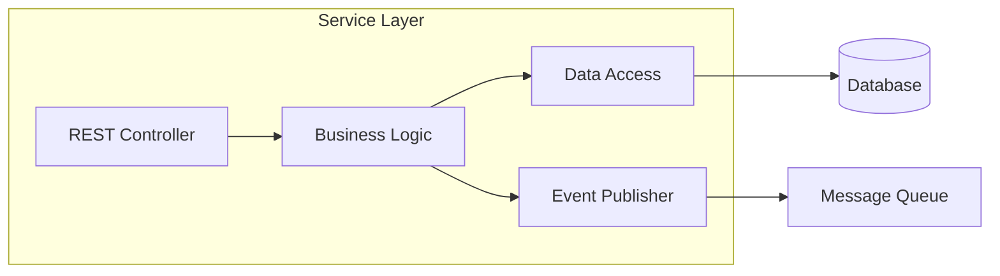
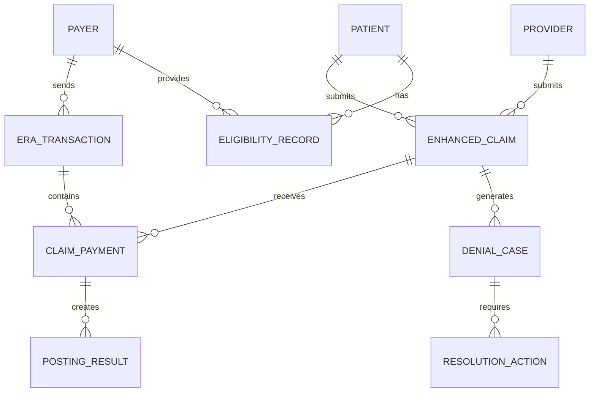
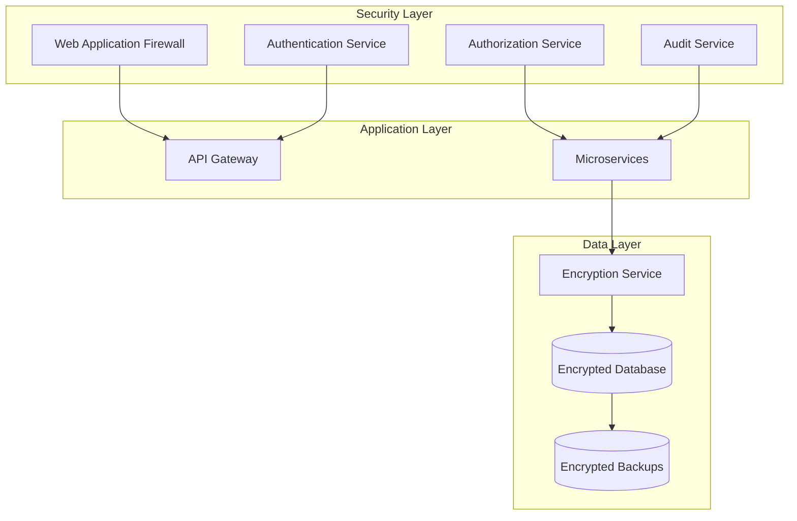

# Design Document

## Overview

The ClaimMD API Compliance Enhancement system is designed as a comprehensive upgrade to the existing RCM system, implementing industry-standard clearinghouse capabilities that align with the Claim.md API specifications. The system follows a microservices architecture with event-driven communication, ensuring scalability, reliability, and real-time processing capabilities.

The design emphasizes seamless integration with existing RCM workflows while providing advanced features including AI-powered claim optimization, real-time eligibility verification, intelligent denial management, and comprehensive revenue analytics. The system maintains HIPAA compliance and implements robust security measures throughout all components.

## Architecture

### High-Level System Architecture

```mermaid
graph TB
    subgraph "Frontend Layer"
        UI[React Dashboard]
        Portal[Patient Portal]
        Mobile[Mobile Interface]
    end
    
    subgraph "API Gateway Layer"
        Gateway[Express.js Gateway]
        Auth[JWT Authentication]
        RateLimit[Rate Limiting]
        Validation[Request Validation]
    end
    
    subgraph "Core Services Layer"
        ClaimMD[ClaimMD Integration Service]
        Eligibility[Eligibility Service]
        Claims[Claims Processing Service]
        Denial[Denial Management Service]
        ERA[ERA Processing Service]
        Analytics[Analytics Service]
        Patient[Patient Financial Service]
        Compliance[Compliance Service]
    end
    
    subgraph "Data Processing Layer"
        EDI[EDI Parser/Generator]
        AI[AI/ML Engine]
        Queue[Message Queue]
        Cache[Redis Cache]
    end
    
    subgraph "Data Layer"
        MySQL[(MySQL Database)]
        S3[(AWS S3 Storage)]
        Audit[(Audit Database)]
    end
    
    subgraph "External Integrations"
        ClaimMDAPI[ClaimMD API]
        Payers[Insurance Payers]
        Clearinghouses[Other Clearinghouses]
        PaymentGW[Payment Gateways]
    end
    
    UI --> Gateway
    Portal --> Gateway
    Mobile --> Gateway
    
    Gateway --> ClaimMD
    Gateway --> Eligibility
    Gateway --> Claims
    Gateway --> Denial
    Gateway --> ERA
    Gateway --> Analytics
    Gateway --> Patient
    Gateway --> Compliance
    
    ClaimMD --> EDI
    Claims --> AI
    Denial --> AI
    Analytics --> AI
    
    ClaimMD --> Queue
    ERA --> Queue
    Claims --> Queue
    
    ClaimMD --> Cache
    Eligibility --> Cache
    
    ClaimMD --> MySQL
    Claims --> MySQL
    Denial --> MySQL
    ERA --> MySQL
    Analytics --> MySQL
    Patient --> MySQL
    Compliance --> Audit
    
    ClaimMD --> S3
    ERA --> S3
    
    ClaimMD --> ClaimMDAPI
    Eligibility --> Payers
    Claims --> Clearinghouses
    Patient --> PaymentGW
```



### Service Architecture Pattern

Each service follows a consistent layered architecture:



## Components and Interfaces

### 1. Enhanced ClaimMD Integration Service

**Purpose**: Comprehensive integration with ClaimMD API supporting all standard clearinghouse operations

**Core Components**:
- **API Client Manager**: Handles authentication, rate limiting, and connection management
- **Transaction Processor**: Processes X12 transactions (837P/I/D, 835, 276/277, 270/271)
- **Validation Engine**: Validates claims against ClaimMD rules
- **Status Synchronizer**: Real-time status updates and notifications

**Key Interfaces**:
```typescript
interface ClaimMDIntegrationService {
  // Authentication and Configuration
  authenticate(credentials: ClaimMDCredentials): Promise<AuthResult>;
  updateConfiguration(config: ClaimMDConfig): Promise<ConfigResult>;
  testConnection(): Promise<ConnectionResult>;
  
  // Claim Submission and Management
  submitClaim(claim: EnhancedClaim): Promise<SubmissionResult>;
  batchSubmitClaims(claims: EnhancedClaim[]): Promise<BatchSubmissionResult>;
  getClaimStatus(claimId: string): Promise<ClaimStatusResult>;
  
  // Transaction Processing
  processX12Transaction(transaction: X12Transaction): Promise<ProcessingResult>;
  validateTransaction(transaction: X12Transaction): Promise<ValidationResult>;
  
  // ERA and Payment Processing
  downloadERA(eraId: string): Promise<ERAFile>;
  processERAFile(eraFile: ERAFile): Promise<ERAProcessingResult>;
}

interface EnhancedClaim {
  claimId: string;
  patientInfo: PatientInfo;
  providerInfo: ProviderInfo;
  serviceLines: ServiceLine[];
  diagnosisCodes: DiagnosisCode[];
  attachments?: ClaimAttachment[];
  priorAuthorization?: PriorAuthInfo;
  claimType: '837P' | '837I' | '837D';
  validationLevel: 'basic' | 'enhanced' | 'comprehensive';
}

interface SubmissionResult {
  claimMDId: string;
  status: 'accepted' | 'rejected' | 'pending';
  confirmationNumber: string;
  validationErrors: ValidationError[];
  estimatedProcessingTime: number;
  trackingUrl: string;
}
```

**Database Schema**:
- `claimmd_configurations` - API configuration and credentials
- `claimmd_submissions` - Submission tracking and status
- `claimmd_transactions` - X12 transaction log
- `claimmd_validation_results` - Validation results and errors

### 2. Real-Time Eligibility Verification System

**Purpose**: Comprehensive insurance eligibility verification with real-time payer integration

**Core Components**:
- **Multi-Payer Interface**: Connects to various payer systems
- **Eligibility Cache Manager**: Intelligent caching with TTL management
- **Coverage Analyzer**: Detailed coverage analysis and benefit calculation
- **Prior Authorization Manager**: Handles PA requirements and workflows

**Key Interfaces**:
```typescript
interface EligibilityVerificationService {
  // Real-time Eligibility Checking
  checkEligibility(request: EligibilityRequest): Promise<EligibilityResult>;
  batchCheckEligibility(requests: EligibilityRequest[]): Promise<BatchEligibilityResult>;
  
  // Coverage Analysis
  analyzeCoverage(patientId: string, serviceDate: Date): Promise<CoverageAnalysis>;
  calculatePatientResponsibility(claim: Claim): Promise<PatientResponsibilityResult>;
  
  // Prior Authorization
  checkPriorAuthRequirement(service: ServiceInfo): Promise<PriorAuthResult>;
  submitPriorAuthRequest(request: PriorAuthRequest): Promise<PriorAuthSubmissionResult>;
  
  // Cache Management
  getCachedEligibility(patientId: string, payerId: string): Promise<CachedEligibilityResult>;
  invalidateEligibilityCache(patientId: string): Promise<void>;
}

interface EligibilityResult {
  eligible: boolean;
  eligibilityDate: Date;
  coverageDetails: CoverageDetails;
  benefitInformation: BenefitInfo[];
  copayAmount: number;
  deductibleInfo: DeductibleInfo;
  coinsuranceRate: number;
  outOfPocketMax: number;
  priorAuthRequired: boolean;
  coverageLimitations: Limitation[];
  effectiveDate: Date;
  terminationDate?: Date;
}

interface CoverageAnalysis {
  coveredServices: ServiceCoverage[];
  excludedServices: ServiceExclusion[];
  requiresPriorAuth: ServiceInfo[];
  patientResponsibility: PatientResponsibilityBreakdown;
  benefitPeriod: BenefitPeriod;
  networkStatus: NetworkStatus;
}
```

**Database Schema**:
- `eligibility_requests` - Eligibility check requests and responses
- `eligibility_cache` - Cached eligibility results with TTL
- `coverage_details` - Detailed coverage information
- `prior_auth_requests` - Prior authorization tracking
- `payer_configurations` - Payer-specific settings and endpoints

### 3. Advanced Claims Processing Engine

**Purpose**: AI-powered claims processing with comprehensive validation and optimization

**Core Components**:
- **Claims Validator**: Multi-level validation engine
- **AI Claims Scrubber**: Machine learning-based error detection and correction
- **Code Optimizer**: Suggests optimal code combinations for maximum reimbursement
- **Batch Processor**: Efficient batch processing with queue management

**Key Interfaces**:
```typescript
interface ClaimsProcessingService {
  // Claim Validation and Processing
  validateClaim(claim: Claim, validationLevel: ValidationLevel): Promise<ValidationResult>;
  scrubClaim(claim: Claim): Promise<ScrubResult>;
  optimizeClaim(claim: Claim): Promise<OptimizationResult>;
  
  // Batch Processing
  processBatch(claims: Claim[]): Promise<BatchProcessingResult>;
  getBatchStatus(batchId: string): Promise<BatchStatus>;
  
  // AI-Powered Features
  suggestCodes(diagnosis: string, procedure: string): Promise<CodeSuggestion[]>;
  predictDenialRisk(claim: Claim): Promise<DenialRiskAssessment>;
  
  // Quality Assurance
  performQualityCheck(claim: Claim): Promise<QualityCheckResult>;
  generateComplianceReport(claims: Claim[]): Promise<ComplianceReport>;
}

interface ValidationResult {
  isValid: boolean;
  validationLevel: ValidationLevel;
  errors: ValidationError[];
  warnings: ValidationWarning[];
  suggestions: ValidationSuggestion[];
  qualityScore: number;
  complianceScore: number;
}

interface ScrubResult {
  originalClaim: Claim;
  scrubbedClaim: Claim;
  corrections: ClaimCorrection[];
  confidenceScore: number;
  requiresReview: boolean;
  estimatedAcceptanceRate: number;
}

interface OptimizationResult {
  originalReimbursement: number;
  optimizedReimbursement: number;
  improvementPercentage: number;
  codeChanges: CodeChange[];
  riskAssessment: RiskAssessment;
  complianceImpact: ComplianceImpact;
}
```

**Database Schema**:
- `claims_processing_queue` - Processing queue with priority management
- `validation_results` - Comprehensive validation results
- `scrubbing_results` - AI scrubbing results and corrections
- `optimization_suggestions` - Code optimization recommendations
- `quality_metrics` - Quality and compliance metrics

### 4. Intelligent Denial Management System

**Purpose**: AI-powered denial management with automated categorization and resolution workflows

**Core Components**:
- **Denial Categorizer**: Automatic categorization using CARC/RARC codes
- **Resolution Engine**: AI-powered resolution suggestions
- **Appeal Generator**: Automated appeal letter generation
- **Outcome Tracker**: Success rate tracking and pattern analysis

**Key Interfaces**:
```typescript
interface DenialManagementService {
  // Denial Processing
  processDenial(denial: DenialNotification): Promise<DenialProcessingResult>;
  categorizeDenial(denial: Denial): Promise<DenialCategory>;
  
  // Resolution Management
  suggestResolution(denial: Denial): Promise<ResolutionSuggestion[]>;
  createResolutionPlan(denialId: string, strategy: ResolutionStrategy): Promise<ResolutionPlan>;
  
  // Appeal Management
  generateAppeal(denialId: string, appealType: AppealType): Promise<AppealDocument>;
  submitAppeal(appeal: Appeal): Promise<AppealSubmissionResult>;
  trackAppealStatus(appealId: string): Promise<AppealStatus>;
  
  // Analytics and Reporting
  analyzeDenialTrends(timeframe: TimeFrame): Promise<DenialTrendAnalysis>;
  generateDenialReport(criteria: ReportCriteria): Promise<DenialReport>;
}

interface DenialProcessingResult {
  denialId: string;
  category: DenialCategory;
  priority: DenialPriority;
  rootCause: RootCauseAnalysis;
  suggestedActions: ResolutionAction[];
  estimatedRecoveryAmount: number;
  resolutionDeadline: Date;
  assignedTo: string;
}

interface ResolutionSuggestion {
  action: ResolutionAction;
  priority: number;
  successRate: number;
  estimatedRecoveryAmount: number;
  timeToResolution: number;
  requiredDocuments: Document[];
  automationPossible: boolean;
}

interface AppealDocument {
  appealId: string;
  appealType: AppealType;
  appealLevel: AppealLevel;
  generatedContent: string;
  supportingDocuments: Document[];
  submissionDeadline: Date;
  trackingNumber: string;
}
```

**Database Schema**:
- `denial_cases` - Denial case management
- `denial_categories` - Categorization and classification
- `resolution_strategies` - Resolution plans and outcomes
- `appeal_documents` - Appeal tracking and documentation
- `denial_analytics` - Trend analysis and reporting data

### 5. Automated ERA Processing and Payment Posting

**Purpose**: Comprehensive ERA processing with intelligent payment matching and automated posting

**Core Components**:
- **ERA Parser**: Multi-format ERA file parsing (X12 835, CSV, Excel)
- **Payment Matcher**: Advanced matching algorithms with fuzzy logic
- **Auto-Posting Engine**: Automated payment posting with rollback capability
- **Variance Analyzer**: Detailed variance analysis and reporting

**Key Interfaces**:
```typescript
interface ERAProcessingService {
  // ERA File Processing
  processERAFile(eraFile: ERAFile): Promise<ERAProcessingResult>;
  parseERAContent(content: string, format: ERAFormat): Promise<ParsedERA>;
  
  // Payment Matching
  matchPayments(eraData: ERAData): Promise<PaymentMatch[]>;
  resolveUnmatchedPayments(unmatchedPayments: UnmatchedPayment[]): Promise<ResolutionResult>;
  
  // Automated Posting
  postPayments(matches: PaymentMatch[]): Promise<PostingResult>;
  postAdjustments(adjustments: Adjustment[]): Promise<AdjustmentResult>;
  
  // Variance Management
  analyzeVariances(postingResults: PostingResult[]): Promise<VarianceAnalysis>;
  generateVarianceReport(criteria: VarianceCriteria): Promise<VarianceReport>;
}

interface ERAProcessingResult {
  eraId: string;
  processingStatus: ProcessingStatus;
  totalPayments: number;
  totalAdjustments: number;
  matchedPayments: number;
  unmatchedPayments: number;
  postedAmount: number;
  varianceAmount: number;
  processingTime: number;
  qualityScore: number;
}

interface PaymentMatch {
  eraLineItem: ERALineItem;
  matchedClaim: Claim;
  matchConfidence: number;
  paymentAmount: number;
  adjustmentAmount: number;
  patientResponsibility: number;
  matchingCriteria: MatchingCriteria[];
  requiresReview: boolean;
}
```

**Database Schema**:
- `era_files` - ERA file processing log
- `era_line_items` - Individual ERA line items
- `payment_matches` - Payment matching results
- `posting_transactions` - Payment posting transactions
- `variance_reports` - Variance analysis and reporting

### 6. Comprehensive Revenue Analytics and Forecasting

**Purpose**: Advanced analytics and ML-powered revenue forecasting with business intelligence

**Core Components**:
- **Analytics Engine**: Real-time analytics processing
- **Forecasting Model**: Machine learning-based revenue predictions
- **KPI Calculator**: Key performance indicator calculations
- **Dashboard Generator**: Dynamic dashboard creation

**Key Interfaces**:
```typescript
interface RevenueAnalyticsService {
  // Revenue Analysis
  generateRevenueAnalysis(criteria: AnalysisCriteria): Promise<RevenueAnalysis>;
  calculateKPIs(timeframe: TimeFrame): Promise<KPIMetrics>;
  
  // Forecasting
  generateRevenueForecast(parameters: ForecastParameters): Promise<RevenueForecast>;
  predictCashFlow(timeframe: TimeFrame): Promise<CashFlowPrediction>;
  
  // Trend Analysis
  analyzeTrends(metrics: MetricType[], timeframe: TimeFrame): Promise<TrendAnalysis>;
  identifyAnomalies(data: AnalyticsData): Promise<AnomalyDetection>;
  
  // Business Intelligence
  generateExecutiveDashboard(userId: string): Promise<ExecutiveDashboard>;
  createCustomReport(reportDefinition: ReportDefinition): Promise<CustomReport>;
}

interface RevenueAnalysis {
  totalRevenue: number;
  revenueByProvider: ProviderRevenue[];
  revenueByPayer: PayerRevenue[];
  revenueByServiceType: ServiceTypeRevenue[];
  collectionRate: number;
  denialRate: number;
  daysInAR: number;
  trendIndicators: TrendIndicator[];
}

interface RevenueForecast {
  forecastPeriod: TimeFrame;
  projectedRevenue: number;
  confidenceInterval: ConfidenceInterval;
  keyDrivers: RevenueDriver[];
  riskFactors: RiskFactor[];
  scenarioAnalysis: ScenarioAnalysis[];
  recommendations: ForecastRecommendation[];
}
```

**Database Schema**:
- `revenue_analytics` - Analytics calculations and results
- `forecast_models` - ML model parameters and results
- `kpi_metrics` - Key performance indicators
- `trend_analysis` - Trend analysis data
- `custom_reports` - User-defined report configurations

## Data Models

### Core Data Entities

```typescript
// Enhanced Claim Entity
interface EnhancedClaim {
  id: string;
  claimNumber: string;
  patientId: string;
  providerId: string;
  payerId: string;
  claimType: ClaimType;
  serviceDate: Date;
  submissionDate: Date;
  totalAmount: number;
  paidAmount: number;
  adjustmentAmount: number;
  patientResponsibility: number;
  claimStatus: ClaimStatus;
  processingStage: ProcessingStage;
  validationResults: ValidationResult[];
  qualityScore: number;
  riskScore: number;
  attachments: ClaimAttachment[];
  auditTrail: AuditEntry[];
}

// Eligibility Entity
interface EligibilityRecord {
  id: string;
  patientId: string;
  payerId: string;
  memberNumber: string;
  groupNumber: string;
  eligibilityDate: Date;
  effectiveDate: Date;
  terminationDate?: Date;
  coverageType: CoverageType;
  planName: string;
  copayAmount: number;
  deductibleAmount: number;
  deductibleMet: number;
  coinsuranceRate: number;
  outOfPocketMax: number;
  outOfPocketMet: number;
  priorAuthRequired: boolean;
  networkStatus: NetworkStatus;
  benefitDetails: BenefitDetail[];
  lastVerified: Date;
  cacheExpiry: Date;
}

// Denial Case Entity
interface DenialCase {
  id: string;
  claimId: string;
  denialDate: Date;
  denialCode: string;
  denialReason: string;
  carcCode: string;
  rarcCode: string;
  denialCategory: DenialCategory;
  rootCause: string;
  denialAmount: number;
  caseStatus: DenialStatus;
  priority: DenialPriority;
  assignedTo: string;
  resolutionStrategy: ResolutionStrategy;
  appealDeadline: Date;
  resolutionActions: ResolutionAction[];
  outcomeTracking: OutcomeTracking;
  createdAt: Date;
  updatedAt: Date;
}

// ERA Transaction Entity
interface ERATransaction {
  id: string;
  eraFileId: string;
  payerName: string;
  checkNumber: string;
  checkDate: Date;
  totalAmount: number;
  claimPayments: ClaimPayment[];
  adjustments: Adjustment[];
  processingStatus: ProcessingStatus;
  matchingResults: MatchingResult[];
  postingResults: PostingResult[];
  varianceAmount: number;
  qualityScore: number;
  processedAt: Date;
}
```

### Relationship Mappings



## Error Handling

### Comprehensive Error Management System

```typescript
enum ErrorSeverity {
  LOW = 'low',
  MEDIUM = 'medium',
  HIGH = 'high',
  CRITICAL = 'critical'
}

enum ErrorCategory {
  VALIDATION = 'validation',
  INTEGRATION = 'integration',
  PROCESSING = 'processing',
  BUSINESS_LOGIC = 'business_logic',
  SYSTEM = 'system',
  SECURITY = 'security'
}

interface EnhancedError {
  id: string;
  code: string;
  message: string;
  severity: ErrorSeverity;
  category: ErrorCategory;
  component: string;
  context: ErrorContext;
  timestamp: Date;
  retryable: boolean;
  resolutionSteps: string[];
  affectedEntities: string[];
  correlationId: string;
}

interface ErrorContext {
  userId?: string;
  claimId?: string;
  transactionId?: string;
  requestData?: any;
  systemState?: any;
  stackTrace?: string;
}
```

### Error Handling Strategies

1. **Transient Errors**: Exponential backoff retry with circuit breaker
2. **Validation Errors**: Immediate feedback with detailed correction guidance
3. **Integration Errors**: Fallback mechanisms with alternative processing paths
4. **Critical Errors**: Immediate alerting with automated escalation
5. **Business Logic Errors**: Workflow suspension with manual intervention triggers

## Testing Strategy

### Multi-Level Testing Approach

#### Unit Testing
- **Service Layer Testing**: Comprehensive business logic validation
- **Repository Testing**: Data access layer validation with mock databases
- **Utility Testing**: Helper functions and calculation validation
- **AI Model Testing**: Machine learning model accuracy and performance testing

#### Integration Testing
- **API Integration Testing**: External service integration validation
- **Database Integration Testing**: Transaction integrity and performance testing
- **Message Queue Testing**: Asynchronous processing validation
- **Cache Integration Testing**: Cache consistency and performance validation

#### End-to-End Testing
- **Complete Workflow Testing**: Full claim lifecycle testing
- **User Journey Testing**: Complete user interaction flows
- **Performance Testing**: Load testing and stress testing
- **Security Testing**: Penetration testing and vulnerability assessment

#### Specialized Testing
- **ClaimMD API Testing**: Comprehensive API integration testing
- **Compliance Testing**: Regulatory compliance validation
- **Data Integrity Testing**: Data consistency and accuracy validation
- **Disaster Recovery Testing**: System recovery and backup validation

## Security and Compliance

### HIPAA Compliance Framework

#### Data Protection
- **Encryption at Rest**: AES-256 encryption for all stored PHI
- **Encryption in Transit**: TLS 1.3 for all data transmission
- **Key Management**: Hardware Security Module (HSM) for key storage
- **Data Masking**: Dynamic data masking for non-production environments

#### Access Controls
- **Multi-Factor Authentication**: Required for all system access
- **Role-Based Access Control**: Granular permissions based on job functions
- **Audit Logging**: Comprehensive audit trails for all PHI access
- **Session Management**: Secure session handling with timeout controls

#### Compliance Monitoring
- **Automated Compliance Checks**: Continuous compliance validation
- **Risk Assessment**: Regular automated risk assessments
- **Incident Response**: Defined incident response procedures
- **Breach Notification**: Automated breach detection and notification

### Security Architecture



### Compliance Features

1. **Data Retention Management**: Automated data lifecycle management
2. **Consent Management**: Patient consent tracking and management
3. **Data Subject Rights**: Automated data subject request handling
4. **Compliance Reporting**: Automated compliance report generation
5. **Vendor Management**: Third-party vendor compliance monitoring

This comprehensive design provides a robust foundation for implementing the ClaimMD API Compliance Enhancement system while maintaining security, compliance, and performance standards.