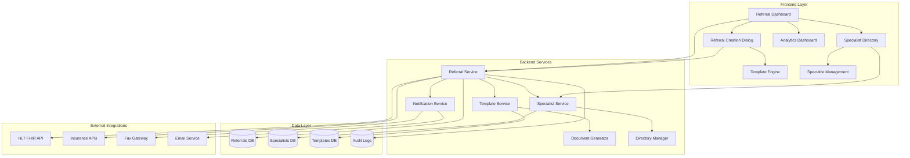

# Design Document

## Overview

The Comprehensive Referral Management System is designed as a modular enhancement to the existing OVHI healthcare platform. It builds upon the current `EncounterReferralDialog` component while adding a complete backend infrastructure, centralized management dashboard, specialist network, and advanced workflow automation. The system follows the established OVHI architecture patterns with React/TypeScript frontend components, Node.js/Express backend services, and MySQL database storage.

## Architecture

### System Architecture Diagram



### Component Hierarchy

```
src/components/referrals/
├── ReferralDashboard.tsx           # Main referral management interface
├── ReferralCreationDialog.tsx      # Enhanced creation dialog
├── ReferralTrackingPanel.tsx       # Status tracking and updates
├── SpecialistDirectory.tsx         # Specialist search and management
├── ReferralAnalytics.tsx          # Analytics and reporting
├── templates/
│   ├── TemplateEditor.tsx         # Template creation and editing
│   └── TemplateSelector.tsx       # Template selection interface
└── shared/
    ├── ReferralCard.tsx           # Individual referral display
    ├── StatusBadge.tsx            # Status visualization
    └── UrgencyIndicator.tsx       # Priority indicators
```

## Components and Interfaces

### Core Components

#### 1. ReferralDashboard Component
**Purpose**: Central hub for all referral management activities
**Key Features**:
- Tabbed interface for active, pending, and completed referrals
- Quick action buttons for common tasks
- Search and filtering capabilities
- Bulk operations support

```typescript
interface ReferralDashboardProps {
  providerId: string;
  patientId?: string;
  filters?: ReferralFilters;
  onReferralSelect: (referral: Referral) => void;
}

interface ReferralFilters {
  status?: ReferralStatus[];
  specialty?: string[];
  urgency?: UrgencyLevel[];
  dateRange?: DateRange;
  specialist?: string;
}
```

#### 2. Enhanced ReferralCreationDialog Component
**Purpose**: Comprehensive referral creation with smart automation
**Key Features**:
- Multi-step wizard interface
- Smart specialist suggestions
- Template-based content generation
- Real-time insurance verification
- Document attachment management

```typescript
interface EnhancedReferralCreationProps {
  encounter?: PatientEncounterData;
  patient: Patient;
  mode: 'encounter' | 'manual' | 'template';
  onSuccess: (referral: Referral) => void;
  onCancel: () => void;
}
```

#### 3. SpecialistDirectory Component
**Purpose**: Comprehensive specialist network management
**Key Features**:
- Advanced search and filtering
- Specialist profile management
- Network status tracking
- Performance metrics display

```typescript
interface SpecialistDirectoryProps {
  mode: 'selection' | 'management';
  filters?: SpecialistFilters;
  onSpecialistSelect?: (specialist: Specialist) => void;
}

interface SpecialistFilters {
  specialty?: string[];
  location?: LocationFilter;
  insuranceNetworks?: string[];
  availability?: AvailabilityFilter;
}
```

### Backend Service Architecture

#### 1. Referral Service (`server/services/referrals/referralService.js`)
**Core Functions**:
- Referral CRUD operations
- Status workflow management
- Integration orchestration
- Business logic enforcement

```javascript
class ReferralService {
  async createReferral(referralData, userId) { }
  async updateReferralStatus(referralId, status, notes) { }
  async getReferralsByProvider(providerId, filters) { }
  async getReferralsByPatient(patientId, filters) { }
  async processAuthorization(referralId) { }
  async generateReferralLetter(referralId, templateId) { }
}
```

#### 2. Specialist Service (`server/services/referrals/specialistService.js`)
**Core Functions**:
- Specialist directory management
- Network status tracking
- Performance analytics
- Integration with external directories

```javascript
class SpecialistService {
  async addSpecialist(specialistData) { }
  async updateSpecialist(specialistId, updates) { }
  async searchSpecialists(criteria) { }
  async getSpecialistPerformance(specialistId) { }
  async syncWithExternalDirectory() { }
}
```

#### 3. Template Service (`server/services/referrals/templateService.js`)
**Core Functions**:
- Template management and versioning
- Dynamic content generation
- Specialty-specific customization
- Document formatting and styling

```javascript
class TemplateService {
  async createTemplate(templateData) { }
  async generateDocument(templateId, referralData) { }
  async getTemplatesBySpecialty(specialty) { }
  async validateTemplate(templateContent) { }
}
```

## Data Models

### Enhanced Referral Model

```sql
CREATE TABLE referrals (
  id VARCHAR(50) PRIMARY KEY,
  patient_id VARCHAR(50) NOT NULL,
  provider_id VARCHAR(50) NOT NULL,
  encounter_id VARCHAR(50),
  specialist_id VARCHAR(50),
  specialty_type VARCHAR(100) NOT NULL,
  referral_reason TEXT NOT NULL,
  clinical_notes TEXT,
  urgency_level ENUM('routine', 'urgent', 'stat') DEFAULT 'routine',
  appointment_type ENUM('consultation', 'treatment', 'second_opinion') DEFAULT 'consultation',
  status ENUM('draft', 'pending', 'sent', 'scheduled', 'completed', 'cancelled') DEFAULT 'draft',
  authorization_required BOOLEAN DEFAULT FALSE,
  authorization_number VARCHAR(100),
  authorization_status ENUM('pending', 'approved', 'denied', 'expired'),
  expected_duration VARCHAR(50),
  follow_up_required BOOLEAN DEFAULT TRUE,
  created_at TIMESTAMP DEFAULT CURRENT_TIMESTAMP,
  updated_at TIMESTAMP DEFAULT CURRENT_TIMESTAMP ON UPDATE CURRENT_TIMESTAMP,
  sent_at TIMESTAMP NULL,
  scheduled_at TIMESTAMP NULL,
  completed_at TIMESTAMP NULL,
  
  FOREIGN KEY (patient_id) REFERENCES patients(id),
  FOREIGN KEY (provider_id) REFERENCES providers(id),
  FOREIGN KEY (encounter_id) REFERENCES encounters(id),
  FOREIGN KEY (specialist_id) REFERENCES specialists(id),
  
  INDEX idx_patient_referrals (patient_id),
  INDEX idx_provider_referrals (provider_id),
  INDEX idx_status_referrals (status),
  INDEX idx_specialty_referrals (specialty_type)
);
```

### Specialist Directory Model

```sql
CREATE TABLE specialists (
  id VARCHAR(50) PRIMARY KEY,
  name VARCHAR(200) NOT NULL,
  title VARCHAR(100),
  specialty_primary VARCHAR(100) NOT NULL,
  specialties_secondary JSON,
  practice_name VARCHAR(200),
  phone VARCHAR(20),
  fax VARCHAR(20),
  email VARCHAR(200),
  address_line1 VARCHAR(200),
  address_line2 VARCHAR(200),
  city VARCHAR(100),
  state VARCHAR(50),
  zip_code VARCHAR(20),
  npi_number VARCHAR(20),
  license_numbers JSON,
  insurance_networks JSON,
  availability_hours JSON,
  accepts_new_patients BOOLEAN DEFAULT TRUE,
  preferred_referral_method ENUM('fax', 'email', 'portal', 'phone') DEFAULT 'fax',
  average_response_time INT, -- in hours
  patient_satisfaction_score DECIMAL(3,2),
  is_active BOOLEAN DEFAULT TRUE,
  created_at TIMESTAMP DEFAULT CURRENT_TIMESTAMP,
  updated_at TIMESTAMP DEFAULT CURRENT_TIMESTAMP ON UPDATE CURRENT_TIMESTAMP,
  
  INDEX idx_specialty_specialists (specialty_primary),
  INDEX idx_location_specialists (city, state),
  INDEX idx_active_specialists (is_active)
);
```

### Referral Templates Model

```sql
CREATE TABLE referral_templates (
  id VARCHAR(50) PRIMARY KEY,
  name VARCHAR(200) NOT NULL,
  specialty VARCHAR(100) NOT NULL,
  template_type ENUM('letter', 'form', 'summary') DEFAULT 'letter',
  content_template TEXT NOT NULL,
  variables JSON, -- Available template variables
  formatting_options JSON,
  is_default BOOLEAN DEFAULT FALSE,
  is_active BOOLEAN DEFAULT TRUE,
  created_by VARCHAR(50),
  created_at TIMESTAMP DEFAULT CURRENT_TIMESTAMP,
  updated_at TIMESTAMP DEFAULT CURRENT_TIMESTAMP ON UPDATE CURRENT_TIMESTAMP,
  
  FOREIGN KEY (created_by) REFERENCES users(id),
  INDEX idx_specialty_templates (specialty),
  INDEX idx_active_templates (is_active)
);
```

### Referral Attachments Model

```sql
CREATE TABLE referral_attachments (
  id VARCHAR(50) PRIMARY KEY,
  referral_id VARCHAR(50) NOT NULL,
  medical_record_id VARCHAR(50),
  file_name VARCHAR(255),
  file_path VARCHAR(500),
  file_type VARCHAR(50),
  file_size INT,
  attachment_type ENUM('medical_record', 'lab_result', 'imaging', 'document', 'other') DEFAULT 'document',
  created_at TIMESTAMP DEFAULT CURRENT_TIMESTAMP,
  
  FOREIGN KEY (referral_id) REFERENCES referrals(id) ON DELETE CASCADE,
  FOREIGN KEY (medical_record_id) REFERENCES medical_records(id),
  INDEX idx_referral_attachments (referral_id)
);
```

## Error Handling

### Error Categories and Responses

#### 1. Validation Errors
- **Missing Required Fields**: Return 400 with specific field validation messages
- **Invalid Data Format**: Return 400 with format requirements
- **Business Rule Violations**: Return 422 with business logic explanations

#### 2. Authorization Errors
- **Insufficient Permissions**: Return 403 with role requirements
- **Invalid Authentication**: Return 401 with re-authentication instructions
- **Resource Access Denied**: Return 403 with ownership validation

#### 3. Integration Errors
- **External API Failures**: Implement retry logic with exponential backoff
- **Network Timeouts**: Provide fallback options and queue for retry
- **Data Synchronization Issues**: Log conflicts and provide manual resolution options

#### 4. System Errors
- **Database Connection Issues**: Implement connection pooling and failover
- **File Storage Errors**: Provide alternative storage options
- **Template Processing Errors**: Fallback to basic templates

### Error Handling Implementation

```javascript
class ReferralErrorHandler {
  static handleValidationError(error) {
    return {
      status: 400,
      message: 'Validation failed',
      details: error.details,
      code: 'VALIDATION_ERROR'
    };
  }
  
  static handleAuthorizationError(error) {
    return {
      status: 403,
      message: 'Authorization required',
      details: error.requirements,
      code: 'AUTHORIZATION_ERROR'
    };
  }
  
  static handleIntegrationError(error) {
    return {
      status: 502,
      message: 'External service unavailable',
      details: error.service,
      code: 'INTEGRATION_ERROR',
      retryAfter: error.retryAfter
    };
  }
}
```

## Testing Strategy

### Unit Testing
- **Component Testing**: Jest + React Testing Library for all React components
- **Service Testing**: Jest for backend services with mocked dependencies
- **Utility Testing**: Comprehensive testing of helper functions and utilities

### Integration Testing
- **API Testing**: Supertest for REST endpoint testing
- **Database Testing**: Test database operations with test fixtures
- **External Integration Testing**: Mock external services for reliable testing

### End-to-End Testing
- **User Workflow Testing**: Cypress for complete referral workflows
- **Cross-browser Testing**: Ensure compatibility across major browsers
- **Mobile Testing**: Responsive design and touch interaction testing

### Performance Testing
- **Load Testing**: Simulate high referral volume scenarios
- **Database Performance**: Query optimization and indexing validation
- **File Upload Testing**: Large attachment handling and storage performance

### Test Coverage Requirements
- **Minimum 80% code coverage** for all new components and services
- **100% coverage** for critical business logic functions
- **Integration test coverage** for all API endpoints
- **E2E test coverage** for primary user workflows

## Security Considerations

### Data Protection
- **Encryption at Rest**: All referral data encrypted using AES-256
- **Encryption in Transit**: TLS 1.3 for all API communications
- **PII Handling**: Strict access controls and audit logging for patient data

### Access Control
- **Role-Based Permissions**: Granular permissions for referral operations
- **Resource-Level Security**: Providers can only access their own referrals
- **Audit Logging**: Complete audit trail for all referral activities

### Compliance Requirements
- **HIPAA Compliance**: Full compliance with healthcare data protection requirements
- **SOC 2 Type II**: Security controls for data processing and storage
- **State Regulations**: Compliance with state-specific healthcare regulations

This design provides a comprehensive foundation for implementing the enhanced referral management system while maintaining consistency with the existing OVHI platform architecture.