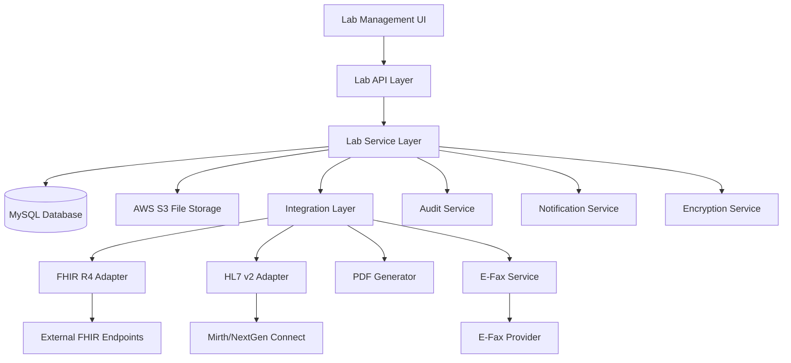

# Lab Integration System Design

## Overview

The Lab Integration System provides a comprehensive solution for healthcare lab ordering, result processing, and provider workflow management. The system supports multiple interoperability standards (FHIR R4, HL7 v2, PDF/e-fax) with full audit trails, security compliance, and integration with existing OVHI modules.

## Architecture

### System Components



### Integration Points

- **Patient Module**: Patient demographics and medical records
- **Encounter Module**: Clinical context and documentation
- **Settings Module**: Provider, organization, and facility configuration
- **RCM Module**: Billing integration and medical necessity
- **Notification System**: Critical result alerts and escalation
- **Audit System**: Comprehensive event logging

## Components and Interfaces

### 1. Data Model

#### Core Tables

```sql
-- Lab Facilities Configuration
CREATE TABLE lab_facilities (
    id INT PRIMARY KEY AUTO_INCREMENT,
    name VARCHAR(255) NOT NULL,
    clia_number VARCHAR(20),
    transport_type ENUM('fax', 'sftp', 'mllp', 'fhir') NOT NULL,
    endpoint_url VARCHAR(500),
    auth_config JSON, -- OAuth2/API key configuration
    is_active BOOLEAN DEFAULT TRUE,
    created_at TIMESTAMP DEFAULT CURRENT_TIMESTAMP,
    updated_at TIMESTAMP DEFAULT CURRENT_TIMESTAMP ON UPDATE CURRENT_TIMESTAMP,
    INDEX idx_active (is_active),
    INDEX idx_transport (transport_type)
);

-- Lab Test Compendium
CREATE TABLE lab_compendium (
    id INT PRIMARY KEY AUTO_INCREMENT,
    lab_facility_id INT NOT NULL,
    lab_test_code VARCHAR(50) NOT NULL,
    loinc_code VARCHAR(20),
    display_name VARCHAR(255) NOT NULL,
    specimen_type VARCHAR(100),
    units VARCHAR(50),
    reference_range VARCHAR(200),
    is_active BOOLEAN DEFAULT TRUE,
    created_at TIMESTAMP DEFAULT CURRENT_TIMESTAMP,
    FOREIGN KEY (lab_facility_id) REFERENCES lab_facilities(id),
    INDEX idx_lab_code (lab_facility_id, lab_test_code),
    INDEX idx_loinc (loinc_code),
    INDEX idx_active (is_active)
);

-- Lab Orders
CREATE TABLE lab_orders (
    id INT PRIMARY KEY AUTO_INCREMENT,
    order_number VARCHAR(50) UNIQUE NOT NULL,
    patient_id INT NOT NULL,
    encounter_id INT,
    lab_facility_id INT NOT NULL,
    status ENUM('draft', 'signed', 'sent', 'ack', 'in_progress', 'partial', 'final', 'corrected', 'canceled') DEFAULT 'draft',
    priority ENUM('routine', 'urgent', 'stat') DEFAULT 'routine',
    icd10_codes JSON, -- Array of ICD-10 codes for medical necessity
    abn_signed BOOLEAN DEFAULT FALSE,
    abn_signature_path VARCHAR(500),
    requester_provider_id INT NOT NULL,
    service_location_id INT,
    clinical_notes TEXT,
    sent_at TIMESTAMP NULL,
    ack_at TIMESTAMP NULL,
    final_at TIMESTAMP NULL,
    created_at TIMESTAMP DEFAULT CURRENT_TIMESTAMP,
    updated_at TIMESTAMP DEFAULT CURRENT_TIMESTAMP ON UPDATE CURRENT_TIMESTAMP,
    FOREIGN KEY (patient_id) REFERENCES patients(id),
    FOREIGN KEY (encounter_id) REFERENCES encounters(id),
    FOREIGN KEY (lab_facility_id) REFERENCES lab_facilities(id),
    FOREIGN KEY (requester_provider_id) REFERENCES providers(id),
    INDEX idx_patient (patient_id),
    INDEX idx_status (status),
    INDEX idx_order_number (order_number),
    INDEX idx_provider (requester_provider_id),
    INDEX idx_created (created_at)
);

-- Lab Order Tests
CREATE TABLE lab_order_tests (
    id INT PRIMARY KEY AUTO_INCREMENT,
    lab_order_id INT NOT NULL,
    compendium_id INT NOT NULL,
    lab_test_code VARCHAR(50) NOT NULL,
    loinc_code VARCHAR(20),
    test_notes TEXT,
    created_at TIMESTAMP DEFAULT CURRENT_TIMESTAMP,
    FOREIGN KEY (lab_order_id) REFERENCES lab_orders(id) ON DELETE CASCADE,
    FOREIGN KEY (compendium_id) REFERENCES lab_compendium(id),
    INDEX idx_order (lab_order_id),
    INDEX idx_loinc (loinc_code)
);

-- Lab Results
CREATE TABLE lab_results (
    id INT PRIMARY KEY AUTO_INCREMENT,
    lab_order_id INT NOT NULL,
    external_report_id VARCHAR(100),
    status ENUM('preliminary', 'final', 'corrected', 'canceled') DEFAULT 'preliminary',
    pdf_path VARCHAR(500),
    raw_payload_encrypted LONGTEXT, -- Encrypted full FHIR/HL7 payload
    received_at TIMESTAMP DEFAULT CURRENT_TIMESTAMP,
    reviewed_by INT,
    reviewed_at TIMESTAMP NULL,
    released_to_portal BOOLEAN DEFAULT FALSE,
    released_at TIMESTAMP NULL,
    FOREIGN KEY (lab_order_id) REFERENCES lab_orders(id),
    FOREIGN KEY (reviewed_by) REFERENCES providers(id),
    INDEX idx_order (lab_order_id),
    INDEX idx_external_id (external_report_id),
    INDEX idx_status (status),
    INDEX idx_received (received_at)
);

-- Lab Observations (Discrete Values)
CREATE TABLE lab_observations (
    id INT PRIMARY KEY AUTO_INCREMENT,
    lab_result_id INT NOT NULL,
    loinc_code VARCHAR(20),
    test_name VARCHAR(255) NOT NULL,
    value_text VARCHAR(500),
    value_numeric DECIMAL(15,6),
    units VARCHAR(50),
    reference_range VARCHAR(200),
    abnormal_flag ENUM('normal', 'high', 'low', 'critical_high', 'critical_low', 'abnormal') DEFAULT 'normal',
    observation_status ENUM('preliminary', 'final', 'corrected', 'canceled') DEFAULT 'preliminary',
    created_at TIMESTAMP DEFAULT CURRENT_TIMESTAMP,
    FOREIGN KEY (lab_result_id) REFERENCES lab_results(id) ON DELETE CASCADE,
    INDEX idx_result (lab_result_id),
    INDEX idx_loinc (loinc_code),
    INDEX idx_abnormal (abnormal_flag),
    INDEX idx_patient_loinc (lab_result_id, loinc_code) -- For trending
);

-- Lab Events (Audit Trail)
CREATE TABLE lab_events (
    id INT PRIMARY KEY AUTO_INCREMENT,
    lab_order_id INT NOT NULL,
    event_type ENUM('order_created', 'order_signed', 'order_sent', 'order_ack', 'result_received', 'result_reviewed', 'result_released', 'critical_alert', 'error') NOT NULL,
    event_detail JSON,
    user_id INT,
    ip_address VARCHAR(45),
    user_agent TEXT,
    created_at TIMESTAMP DEFAULT CURRENT_TIMESTAMP,
    FOREIGN KEY (lab_order_id) REFERENCES lab_orders(id),
    FOREIGN KEY (user_id) REFERENCES users(id),
    INDEX idx_order (lab_order_id),
    INDEX idx_event_type (event_type),
    INDEX idx_created (created_at)
);

-- Critical Result Escalations
CREATE TABLE lab_critical_escalations (
    id INT PRIMARY KEY AUTO_INCREMENT,
    lab_observation_id INT NOT NULL,
    escalation_level INT DEFAULT 1,
    notified_provider_id INT,
    notification_method ENUM('email', 'sms', 'phone', 'in_app') NOT NULL,
    acknowledged BOOLEAN DEFAULT FALSE,
    acknowledged_at TIMESTAMP NULL,
    acknowledged_by INT,
    retry_count INT DEFAULT 0,
    next_retry_at TIMESTAMP,
    created_at TIMESTAMP DEFAULT CURRENT_TIMESTAMP,
    FOREIGN KEY (lab_observation_id) REFERENCES lab_observations(id),
    FOREIGN KEY (notified_provider_id) REFERENCES providers(id),
    FOREIGN KEY (acknowledged_by) REFERENCES providers(id),
    INDEX idx_observation (lab_observation_id),
    INDEX idx_acknowledged (acknowledged),
    INDEX idx_retry (next_retry_at)
);
```

### 2. API Contracts

#### Lab Compendium API
```typescript
// GET /api/labs/:labId/compendium
interface LabCompendiumResponse {
  success: boolean;
  data: {
    labFacility: {
      id: number;
      name: string;
      cliaNumber: string;
      transportType: 'fax' | 'sftp' | 'mllp' | 'fhir';
    };
    tests: Array<{
      id: number;
      labTestCode: string;
      loincCode: string;
      displayName: string;
      specimenType: string;
      units: string;
      referenceRange: string;
    }>;
  };
}
```

#### Lab Order Creation API
```typescript
// POST /api/lab-orders
interface CreateLabOrderRequest {
  patientId: number;
  encounterId?: number;
  labFacilityId: number;
  tests: Array<{
    compendiumId: number;
    testNotes?: string;
  }>;
  icd10Codes: Array<{
    code: string;
    description: string;
  }>;
  priority: 'routine' | 'urgent' | 'stat';
  clinicalNotes?: string;
  abnSigned?: boolean;
}

interface CreateLabOrderResponse {
  success: boolean;
  data: {
    orderId: number;
    orderNumber: string;
    status: string;
    abnRequired: boolean;
  };
}
```

#### Order Transmission API
```typescript
// POST /api/lab-orders/:id/send
interface SendLabOrderRequest {
  transmissionMode: 'fax' | 'fhir' | 'hl7';
  recipientInfo?: {
    faxNumber?: string;
    endpoint?: string;
  };
}

interface SendLabOrderResponse {
  success: boolean;
  data: {
    transmissionId: string;
    status: 'sent' | 'failed';
    message?: string;
  };
}
```

#### Results Ingestion API
```typescript
// POST /api/lab-results/inbound
interface InboundResultRequest {
  orderNumber?: string;
  externalReportId: string;
  status: 'preliminary' | 'final' | 'corrected';
  pdfBase64?: string;
  observations: Array<{
    loincCode: string;
    testName: string;
    value: string;
    units?: string;
    referenceRange?: string;
    abnormalFlag?: 'normal' | 'high' | 'low' | 'critical_high' | 'critical_low' | 'abnormal';
  }>;
  rawPayload: any; // FHIR or HL7 payload
}
```

#### Result Review API
```typescript
// POST /api/lab-results/:resultId/attest
interface AttestResultRequest {
  reviewedBy: number;
  releaseToPortal: boolean;
  clinicalNotes?: string;
}
```

### 3. Parser Specifications

#### FHIR R4 Mapping

**Outbound ServiceRequest:**
```typescript
interface FHIRServiceRequest {
  resourceType: "ServiceRequest";
  id: string;
  status: "active" | "completed" | "cancelled";
  intent: "order";
  code: {
    coding: [{
      system: "http://loinc.org";
      code: string; // LOINC code
      display: string;
    }];
  };
  subject: {
    reference: string; // Patient reference
  };
  requester: {
    reference: string; // Practitioner reference
  };
  reasonCode: Array<{
    coding: [{
      system: "http://hl7.org/fhir/sid/icd-10-cm";
      code: string; // ICD-10 code
    }];
  }>;
  specimen?: {
    reference: string; // Specimen reference
  };
}
```

**Inbound DiagnosticReport/Observation:**
```typescript
interface FHIRDiagnosticReport {
  resourceType: "DiagnosticReport";
  status: "preliminary" | "final" | "corrected";
  code: {
    coding: [{
      system: "http://loinc.org";
      code: string;
    }];
  };
  subject: {
    reference: string;
  };
  result: Array<{
    reference: string; // Observation references
  }>;
}

interface FHIRObservation {
  resourceType: "Observation";
  status: "preliminary" | "final" | "corrected";
  code: {
    coding: [{
      system: "http://loinc.org";
      code: string;
      display: string;
    }];
  };
  valueQuantity?: {
    value: number;
    unit: string;
    system: "http://unitsofmeasure.org";
  };
  valueString?: string;
  referenceRange?: Array<{
    low?: { value: number; unit: string; };
    high?: { value: number; unit: string; };
    text?: string;
  }>;
  interpretation?: Array<{
    coding: [{
      system: "http://terminology.hl7.org/CodeSystem/v3-ObservationInterpretation";
      code: "H" | "L" | "HH" | "LL" | "N";
    }];
  }>;
}
```

#### HL7 v2 Mapping

**Outbound ORM^O01 Message Structure:**
```
MSH|^~\&|OVHI|CLINIC|LAB|LABSYS|20240817120000||ORM^O01^ORM_O01|MSG001|P|2.5.1
PID|1||PATID123^^^CLINIC^MR||DOE^JOHN^M||19800101|M|||123 MAIN ST^^CITY^ST^12345^USA|||||||123456789
ORC|NW|ORD001|LAB001|||||||||^SMITH^JANE^M^MD^^^^^NPI^1234567890
OBR|1|ORD001|LAB001|CBC^COMPLETE BLOOD COUNT^L|||20240817120000|||||||||^SMITH^JANE^M^MD^^^^^NPI^1234567890||||||||F
DG1|1||Z00.00^Encounter for general adult medical examination without abnormal findings^ICD10CM
SPM|1|SPEC001||BLD^Blood^HL70487|||||||P^Patient^HL70369
NTE|1||Routine annual physical examination
```

**Inbound ORU^R01 Message Processing:**
- Extract MSH for message control and sending facility
- Parse PID for patient identification and demographics matching
- Process OBR for order identification and test information
- Extract OBX segments for discrete observations:
  - OBX-3: Test code (LOINC preferred)
  - OBX-5: Result value
  - OBX-6: Units
  - OBX-7: Reference range
  - OBX-8: Abnormal flags (H, L, HH, LL, A, AA)
  - OBX-11: Observation result status (F, P, C, X)

### 4. PDF Generation Specifications

#### Lab Requisition PDF Layout
```typescript
interface RequisitionPDFData {
  header: {
    facilityName: string;
    facilityAddress: string;
    cliaNumber: string;
    phoneNumber: string;
    faxNumber: string;
  };
  patient: {
    name: string;
    dateOfBirth: string;
    gender: string;
    address: string;
    phoneNumber: string;
    insuranceInfo: string;
  };
  order: {
    orderNumber: string;
    orderDate: string;
    priority: string;
    collectDateTime?: string;
  };
  provider: {
    name: string;
    npiNumber: string;
    taxonomyCode: string;
    signature: string;
  };
  tests: Array<{
    labTestCode: string;
    loincCode: string;
    testName: string;
    specimenType: string;
  }>;
  diagnosis: Array<{
    icd10Code: string;
    description: string;
  }>;
  barcodes: {
    orderBarcode: string; // Code128 format
    qrCode: string; // Portal link
  };
  instructions: {
    collectionInstructions: string;
    patientPrep: string;
    specialHandling: string;
  };
}
```

#### Specimen Label Specification
```typescript
interface SpecimenLabelData {
  patientName: string;
  dateOfBirth: string;
  orderNumber: string;
  specimenType: string;
  collectionDateTime: string;
  barcode: string; // Code128 format
}
```

## Data Models

### Status Lifecycle Management

```typescript
enum LabOrderStatus {
  DRAFT = 'draft',
  SIGNED = 'signed',
  SENT = 'sent',
  ACKNOWLEDGED = 'ack',
  IN_PROGRESS = 'in_progress',
  PARTIAL = 'partial',
  FINAL = 'final',
  CORRECTED = 'corrected',
  CANCELED = 'canceled'
}

interface StatusTransition {
  from: LabOrderStatus;
  to: LabOrderStatus;
  requiredConditions: string[];
  auditEvent: string;
}

const statusTransitions: StatusTransition[] = [
  {
    from: LabOrderStatus.DRAFT,
    to: LabOrderStatus.SIGNED,
    requiredConditions: ['provider_signature', 'required_fields_complete'],
    auditEvent: 'order_signed'
  },
  {
    from: LabOrderStatus.SIGNED,
    to: LabOrderStatus.SENT,
    requiredConditions: ['transmission_successful'],
    auditEvent: 'order_sent'
  },
  // ... additional transitions
];
```

### Critical Result Escalation Logic

```typescript
interface EscalationRule {
  loincCode?: string;
  abnormalFlag: 'critical_high' | 'critical_low';
  escalationLevels: Array<{
    level: number;
    delayMinutes: number;
    notificationMethods: ('email' | 'sms' | 'phone' | 'in_app')[];
    recipientRoles: string[];
  }>;
}

const criticalEscalationRules: EscalationRule[] = [
  {
    loincCode: '33747-0', // Hemoglobin A1c
    abnormalFlag: 'critical_high',
    escalationLevels: [
      {
        level: 1,
        delayMinutes: 0,
        notificationMethods: ['in_app', 'email'],
        recipientRoles: ['ordering_provider']
      },
      {
        level: 2,
        delayMinutes: 30,
        notificationMethods: ['sms', 'phone'],
        recipientRoles: ['ordering_provider', 'supervising_physician']
      }
    ]
  }
];
```

## Error Handling

### Transmission Error Recovery
- Exponential backoff for failed transmissions
- Dead letter queue for persistent failures
- Manual retry capability with error analysis
- Fallback to alternative transmission methods

### Data Validation
- LOINC code validation against standard terminology
- ICD-10 code validation for medical necessity
- Patient demographic matching for result correlation
- Duplicate result detection and handling

### Security Error Handling
- PHI redaction in error logs
- Secure error reporting to administrators
- Audit trail for all error events
- Automated security incident response

## Testing Strategy

### Unit Testing
- FHIR/HL7 parser validation with synthetic data
- PDF generation with various data scenarios
- Abnormal flag calculation logic
- Encryption/decryption functionality

### Integration Testing
- End-to-end FHIR workflow with test endpoints
- HL7 message processing with Mirth Connect
- E-fax transmission and delivery confirmation
- Database transaction integrity

### Security Testing
- PHI handling and redaction verification
- Encryption at rest and in transit validation
- Authentication and authorization testing
- Audit trail completeness verification

### Performance Testing
- High-volume result ingestion scenarios
- Concurrent order processing
- Database query optimization
- File storage and retrieval performance

This design provides a comprehensive foundation for implementing the Lab Integration System with full interoperability, security, and compliance features integrated into the existing OVHI platform architecture.