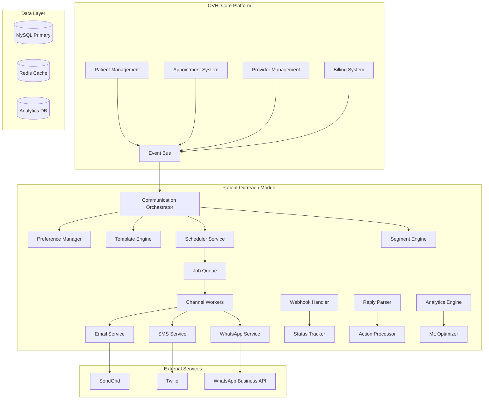

# Design Document

## Overview

The Patient Interaction & Outreach module is designed as a microservice-based system that integrates with the existing OVHI healthcare platform. The system follows event-driven architecture patterns with queue-based job processing, webhook handling, and real-time analytics. The design prioritizes HIPAA compliance, scalability, and intelligent automation while maintaining strict separation between PHI and non-PHI data flows.

## Architecture

### High-Level Architecture



### Service Components

#### 1. Communication Orchestrator
- **Purpose**: Central coordination service for all outbound communications
- **Responsibilities**: 
  - Receives communication requests from OVHI core systems
  - Validates patient preferences and consent
  - Determines optimal channel and timing
  - Queues jobs for processing

#### 2. Preference Manager
- **Purpose**: Manages patient communication preferences and consent
- **Responsibilities**:
  - Hierarchical preference resolution (Patient → Provider → Org → Global)
  - Consent tracking and opt-out handling
  - Timezone and scheduling preference management

#### 3. Template Engine
- **Purpose**: Manages communication templates and variable substitution
- **Responsibilities**:
  - Template storage and versioning
  - Variable substitution with PHI filtering
  - Multi-language support
  - A/B variant management

#### 4. Scheduler Service
- **Purpose**: Intelligent scheduling of communications
- **Responsibilities**:
  - Timezone-aware scheduling
  - Quiet hours enforcement
  - Best-hour optimization
  - Retry scheduling for failed deliveries

#### 5. Segment Engine
- **Purpose**: Patient segmentation and campaign management
- **Responsibilities**:
  - JSON-based rule evaluation
  - Dynamic segment membership updates
  - Campaign expansion to individual jobs
  - A/B test assignment

#### 6. Channel Workers
- **Purpose**: Execute actual message delivery through external providers
- **Responsibilities**:
  - Provider API integration
  - Rate limiting and throttling
  - Delivery status tracking
  - Error handling and retries

#### 7. Webhook Handler
- **Purpose**: Process delivery status updates from external providers
- **Responsibilities**:
  - Idempotent webhook processing
  - Status mapping and normalization
  - Real-time status updates

#### 8. Reply Parser
- **Purpose**: Process inbound patient responses
- **Responsibilities**:
  - Multi-language reply parsing
  - Intent recognition (confirm/reschedule/stop)
  - Routing to appropriate action handlers

#### 9. Analytics Engine
- **Purpose**: Real-time analytics and reporting
- **Responsibilities**:
  - Engagement tracking
  - Funnel analysis
  - A/B test evaluation
  - ROI calculation

#### 10. ML Optimizer
- **Purpose**: Machine learning-based optimization
- **Responsibilities**:
  - Best-hour learning
  - Channel preference prediction
  - Content optimization
  - Fatigue detection

## Components and Interfaces

### API Endpoints

#### Patient Communication Context
```typescript
GET /api/v1/patients/:patientId/comm-context
Response: {
  preferences: {
    timezone: string,
    language: string,
    quiet_hours: { start: string, end: string },
    work_hours: { start: string, end: string },
    channels: {
      email: { enabled: boolean, address: string, marketing_opt_in: boolean },
      sms: { enabled: boolean, number: string, marketing_opt_in: boolean },
      whatsapp: { enabled: boolean, number: string, marketing_opt_in: boolean }
    },
    best_hour: number | null
  },
  segments: string[],
  recent_activity: {
    last_sent: string,
    last_opened: string,
    last_replied: string,
    fatigue_score: number
  }
}
```

#### Schedule Communication
```typescript
POST /api/v1/comm/schedule
Request: {
  patient_id: string,
  purpose: 'appt_confirm' | 'appt_reminder' | 'no_show' | 'rx_refill' | 'lab_ready' | 'campaign_education' | 'urgent',
  template_id?: string,
  variables: Record<string, any>,
  preferred_channel?: 'email' | 'sms' | 'whatsapp',
  send_at?: string, // ISO datetime
  campaign_id?: string,
  is_urgent?: boolean
}
Response: {
  job_id: string,
  scheduled_at: string,
  channel: string,
  estimated_delivery: string
}
```

#### Webhook Handlers
```typescript
POST /api/v1/comm/webhook/outbound-status
Request: {
  provider: 'sendgrid' | 'twilio' | 'whatsapp',
  message_id: string,
  status: string,
  timestamp: string,
  event_data: Record<string, any>
}

POST /api/v1/comm/webhook/inbound
Request: {
  provider: 'twilio' | 'whatsapp',
  from: string,
  to: string,
  body: string,
  timestamp: string,
  message_id: string
}
```

### Data Models

#### Patient Communication Preferences
```sql
CREATE TABLE patient_comm_prefs (
    id INT PRIMARY KEY AUTO_INCREMENT,
    patient_id INT NOT NULL,
    timezone VARCHAR(50) DEFAULT 'America/New_York',
    language VARCHAR(10) DEFAULT 'en',
    quiet_start TIME DEFAULT '22:00:00',
    quiet_end TIME DEFAULT '08:00:00',
    work_start TIME DEFAULT '09:00:00',
    work_end TIME DEFAULT '17:00:00',
    best_hour TINYINT NULL,
    allow_email BOOLEAN DEFAULT TRUE,
    allow_sms BOOLEAN DEFAULT TRUE,
    allow_whatsapp BOOLEAN DEFAULT FALSE,
    marketing_opt_in_email BOOLEAN DEFAULT FALSE,
    marketing_opt_in_sms BOOLEAN DEFAULT FALSE,
    marketing_opt_in_whatsapp BOOLEAN DEFAULT FALSE,
    email_address VARCHAR(255),
    sms_number VARCHAR(20),
    whatsapp_number VARCHAR(20),
    created_at TIMESTAMP DEFAULT CURRENT_TIMESTAMP,
    updated_at TIMESTAMP DEFAULT CURRENT_TIMESTAMP ON UPDATE CURRENT_TIMESTAMP,
    FOREIGN KEY (patient_id) REFERENCES patients(id),
    INDEX idx_patient_id (patient_id)
);
```

#### Communication Templates
```sql
CREATE TABLE comm_templates (
    id INT PRIMARY KEY AUTO_INCREMENT,
    name VARCHAR(255) NOT NULL,
    purpose ENUM('appt_confirm', 'appt_reminder', 'no_show', 'rx_refill', 'lab_ready', 'campaign_education', 'urgent') NOT NULL,
    channel ENUM('email', 'sms', 'whatsapp') NOT NULL,
    language VARCHAR(10) DEFAULT 'en',
    subject VARCHAR(255), -- for email only
    body TEXT NOT NULL,
    variables JSON, -- allowed variables for this template
    is_marketing BOOLEAN DEFAULT FALSE,
    organization_id INT,
    provider_id INT,
    is_active BOOLEAN DEFAULT TRUE,
    created_at TIMESTAMP DEFAULT CURRENT_TIMESTAMP,
    updated_at TIMESTAMP DEFAULT CURRENT_TIMESTAMP ON UPDATE CURRENT_TIMESTAMP,
    INDEX idx_purpose_channel (purpose, channel),
    INDEX idx_organization (organization_id),
    INDEX idx_provider (provider_id)
);
```

#### Patient Segments
```sql
CREATE TABLE patient_segments (
    id INT PRIMARY KEY AUTO_INCREMENT,
    name VARCHAR(255) NOT NULL,
    description TEXT,
    rules JSON NOT NULL, -- JSON-based segmentation rules
    organization_id INT,
    created_by INT,
    is_active BOOLEAN DEFAULT TRUE,
    last_evaluated TIMESTAMP,
    patient_count INT DEFAULT 0,
    created_at TIMESTAMP DEFAULT CURRENT_TIMESTAMP,
    updated_at TIMESTAMP DEFAULT CURRENT_TIMESTAMP ON UPDATE CURRENT_TIMESTAMP,
    INDEX idx_organization (organization_id),
    INDEX idx_active (is_active)
);
```

#### Communication Campaigns
```sql
CREATE TABLE comm_campaigns (
    id INT PRIMARY KEY AUTO_INCREMENT,
    name VARCHAR(255) NOT NULL,
    description TEXT,
    segment_id INT NOT NULL,
    steps JSON NOT NULL, -- array of campaign steps with offsets
    ab_variants JSON, -- A/B test variants
    organization_id INT,
    created_by INT,
    status ENUM('draft', 'active', 'paused', 'completed') DEFAULT 'draft',
    start_date DATE,
    end_date DATE,
    created_at TIMESTAMP DEFAULT CURRENT_TIMESTAMP,
    updated_at TIMESTAMP DEFAULT CURRENT_TIMESTAMP ON UPDATE CURRENT_TIMESTAMP,
    FOREIGN KEY (segment_id) REFERENCES patient_segments(id),
    INDEX idx_organization_status (organization_id, status),
    INDEX idx_segment (segment_id)
);
```

#### Communication Jobs
```sql
CREATE TABLE comm_jobs (
    id INT PRIMARY KEY AUTO_INCREMENT,
    patient_id INT NOT NULL,
    template_id INT NOT NULL,
    campaign_id INT NULL,
    purpose VARCHAR(50) NOT NULL,
    channel ENUM('email', 'sms', 'whatsapp') NOT NULL,
    recipient VARCHAR(255) NOT NULL, -- email or phone number
    subject VARCHAR(255),
    body TEXT NOT NULL,
    variables JSON,
    scheduled_at TIMESTAMP NOT NULL,
    sent_at TIMESTAMP NULL,
    status ENUM('queued', 'processing', 'sent', 'delivered', 'opened', 'clicked', 'replied', 'bounced', 'failed', 'cancelled') DEFAULT 'queued',
    provider_message_id VARCHAR(255),
    error_message TEXT,
    retry_count TINYINT DEFAULT 0,
    is_urgent BOOLEAN DEFAULT FALSE,
    ab_variant VARCHAR(50),
    created_at TIMESTAMP DEFAULT CURRENT_TIMESTAMP,
    updated_at TIMESTAMP DEFAULT CURRENT_TIMESTAMP ON UPDATE CURRENT_TIMESTAMP,
    FOREIGN KEY (patient_id) REFERENCES patients(id),
    FOREIGN KEY (template_id) REFERENCES comm_templates(id),
    FOREIGN KEY (campaign_id) REFERENCES comm_campaigns(id),
    INDEX idx_patient_status (patient_id, status),
    INDEX idx_scheduled_status (scheduled_at, status),
    INDEX idx_provider_message (provider_message_id),
    INDEX idx_campaign (campaign_id)
);
```

#### Inbound Communications
```sql
CREATE TABLE comm_inbound (
    id INT PRIMARY KEY AUTO_INCREMENT,
    patient_id INT,
    channel ENUM('sms', 'whatsapp', 'email') NOT NULL,
    from_address VARCHAR(255) NOT NULL,
    to_address VARCHAR(255) NOT NULL,
    body TEXT NOT NULL,
    intent ENUM('confirm', 'reschedule', 'stop', 'other') NULL,
    related_job_id INT NULL,
    provider_message_id VARCHAR(255),
    processed BOOLEAN DEFAULT FALSE,
    processed_at TIMESTAMP NULL,
    created_at TIMESTAMP DEFAULT CURRENT_TIMESTAMP,
    FOREIGN KEY (patient_id) REFERENCES patients(id),
    FOREIGN KEY (related_job_id) REFERENCES comm_jobs(id),
    INDEX idx_patient_channel (patient_id, channel),
    INDEX idx_processed (processed),
    INDEX idx_provider_message (provider_message_id)
);
```

#### Communication Statistics
```sql
CREATE TABLE comm_stats (
    id INT PRIMARY KEY AUTO_INCREMENT,
    date DATE NOT NULL,
    organization_id INT,
    provider_id INT,
    channel ENUM('email', 'sms', 'whatsapp') NOT NULL,
    purpose VARCHAR(50) NOT NULL,
    sent_count INT DEFAULT 0,
    delivered_count INT DEFAULT 0,
    opened_count INT DEFAULT 0,
    clicked_count INT DEFAULT 0,
    replied_count INT DEFAULT 0,
    bounced_count INT DEFAULT 0,
    unsubscribed_count INT DEFAULT 0,
    created_at TIMESTAMP DEFAULT CURRENT_TIMESTAMP,
    updated_at TIMESTAMP DEFAULT CURRENT_TIMESTAMP ON UPDATE CURRENT_TIMESTAMP,
    UNIQUE KEY unique_stats (date, organization_id, provider_id, channel, purpose),
    INDEX idx_date_org (date, organization_id),
    INDEX idx_channel_purpose (channel, purpose)
);
```

#### Audit Log
```sql
CREATE TABLE comm_audit_log (
    id INT PRIMARY KEY AUTO_INCREMENT,
    patient_id INT,
    user_id INT,
    action ENUM('send', 'receive', 'opt_out', 'opt_in', 'preference_change', 'access') NOT NULL,
    details JSON,
    ip_address VARCHAR(45),
    user_agent TEXT,
    created_at TIMESTAMP DEFAULT CURRENT_TIMESTAMP,
    FOREIGN KEY (patient_id) REFERENCES patients(id),
    INDEX idx_patient_action (patient_id, action),
    INDEX idx_created_at (created_at)
);
```

## Error Handling

### Queue Error Handling
- **Retry Strategy**: Exponential backoff with jitter (1s, 2s, 4s, 8s, 16s)
- **Dead Letter Queue**: Jobs failing after 5 retries move to DLQ for manual review
- **Circuit Breaker**: Automatic service degradation when error rates exceed 10%
- **Graceful Degradation**: Fall back to alternative channels when primary fails

### Webhook Error Handling
- **Idempotency**: Use provider message ID + timestamp for deduplication
- **Validation**: Verify webhook signatures and payload structure
- **Rate Limiting**: Implement per-provider rate limits to prevent abuse
- **Monitoring**: Alert on webhook processing failures or delays

### Data Consistency
- **Transactional Updates**: Use database transactions for multi-table updates
- **Event Sourcing**: Maintain audit trail for all preference changes
- **Eventual Consistency**: Accept temporary inconsistencies for performance
- **Conflict Resolution**: Last-write-wins for preference conflicts

## Testing Strategy

### Unit Testing
- **Service Layer**: Mock external dependencies, test business logic
- **Template Engine**: Validate variable substitution and PHI filtering
- **Scheduler**: Test timezone calculations and quiet hour enforcement
- **Reply Parser**: Test intent recognition across languages

### Integration Testing
- **Webhook Processing**: Test end-to-end delivery status updates
- **Queue Processing**: Validate job lifecycle from creation to completion
- **Database Transactions**: Test data consistency across service boundaries
- **External APIs**: Test provider integrations with sandbox environments

### End-to-End Testing
- **Patient Journey**: Complete appointment reminder workflow
- **Campaign Execution**: Multi-step drip campaign with A/B testing
- **Compliance Scenarios**: Opt-out handling and preference inheritance
- **Emergency Communications**: Urgent message bypass testing

### Performance Testing
- **Load Testing**: 10,000 concurrent jobs processing
- **Stress Testing**: Peak campaign launch scenarios
- **Scalability Testing**: Auto-scaling worker validation
- **Database Performance**: Query optimization under load

### Security Testing
- **PHI Protection**: Verify no PHI in SMS/WhatsApp channels
- **Token Security**: Test portal link token validation and expiration
- **Access Control**: Validate RBAC for all endpoints
- **Audit Compliance**: Verify complete audit trail capture