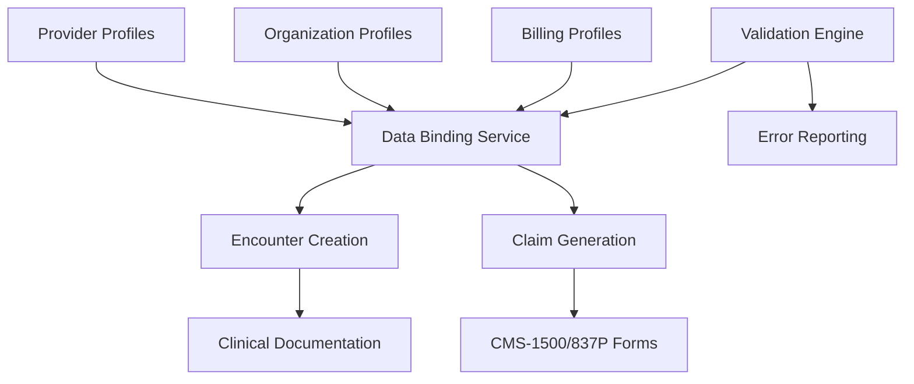
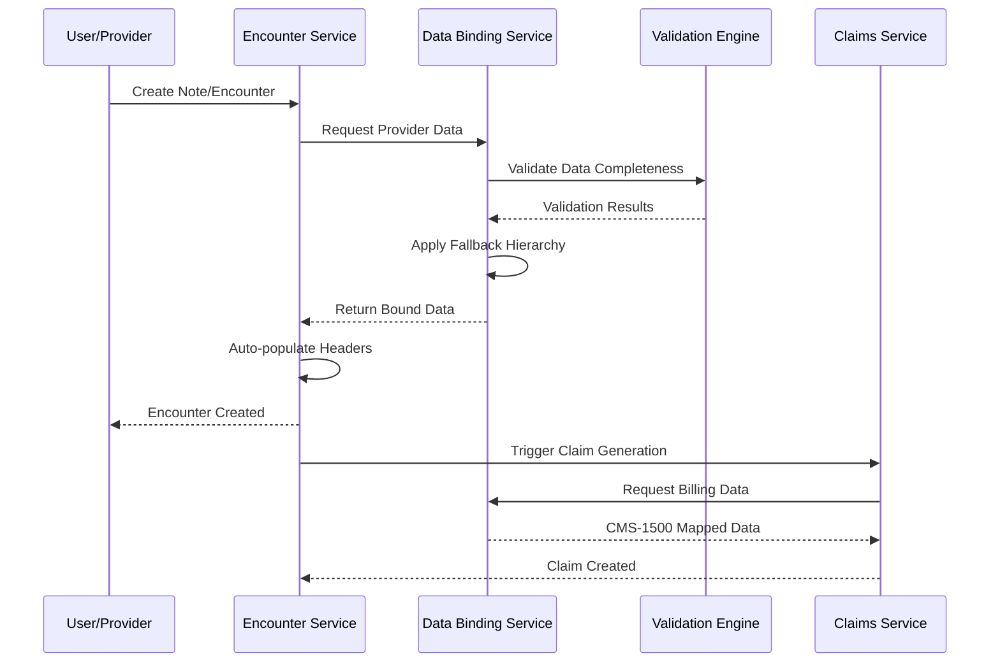

# Provider Data Propagation Validation - Design Document

## Overview

This design implements a comprehensive provider data propagation system for the OVHI EHR platform. The solution addresses critical gaps in provider profile management, encounter header auto-binding, and CMS-1500 claim mapping through structured database schemas, automated data binding services, and robust validation mechanisms.

## Architecture

### High-Level Architecture



### Data Flow Architecture



## Components and Interfaces

### 1. Database Schema Components

#### Provider Profile Tables
```sql
-- Core provider information
CREATE TABLE provider_profiles (
    id INT PRIMARY KEY AUTO_INCREMENT,
    provider_id VARCHAR(50) UNIQUE NOT NULL,
    user_id INT NOT NULL,
    display_name VARCHAR(255) NOT NULL,
    npi_type1 VARCHAR(10) NOT NULL,
    taxonomy_code VARCHAR(20) NOT NULL,
    specialty VARCHAR(100),
    credentials VARCHAR(100),
    is_active BOOLEAN DEFAULT TRUE,
    created_at TIMESTAMP DEFAULT CURRENT_TIMESTAMP,
    updated_at TIMESTAMP DEFAULT CURRENT_TIMESTAMP ON UPDATE CURRENT_TIMESTAMP,
    
    FOREIGN KEY (user_id) REFERENCES users(user_id),
    INDEX idx_provider_id (provider_id),
    INDEX idx_npi_type1 (npi_type1),
    INDEX idx_taxonomy (taxonomy_code)
);

-- Organization profiles for billing entities
CREATE TABLE org_profiles (
    id INT PRIMARY KEY AUTO_INCREMENT,
    org_id VARCHAR(50) UNIQUE NOT NULL,
    legal_name VARCHAR(255) NOT NULL,
    tax_id_ein VARCHAR(20) NOT NULL,
    pay_to_name VARCHAR(255) NOT NULL,
    pay_to_npi_type2 VARCHAR(10) NOT NULL,
    pay_to_address JSON NOT NULL,
    parent_org_id INT,
    is_active BOOLEAN DEFAULT TRUE,
    created_at TIMESTAMP DEFAULT CURRENT_TIMESTAMP,
    
    FOREIGN KEY (parent_org_id) REFERENCES org_profiles(id),
    INDEX idx_org_id (org_id),
    INDEX idx_tax_id_ein (tax_id_ein),
    INDEX idx_pay_to_npi (pay_to_npi_type2)
);

-- Billing-specific configurations
CREATE TABLE billing_profiles (
    id INT PRIMARY KEY AUTO_INCREMENT,
    billing_org_id VARCHAR(50) NOT NULL,
    org_profile_id INT NOT NULL,
    billing_npi_type2 VARCHAR(10) NOT NULL,
    tax_id_ein VARCHAR(20) NOT NULL,
    clia VARCHAR(20),
    taxonomy_code VARCHAR(20),
    contact_phone VARCHAR(20),
    billing_address JSON,
    clearinghouse_config JSON,
    is_default BOOLEAN DEFAULT FALSE,
    is_active BOOLEAN DEFAULT TRUE,
    created_at TIMESTAMP DEFAULT CURRENT_TIMESTAMP,
    
    FOREIGN KEY (org_profile_id) REFERENCES org_profiles(id),
    INDEX idx_billing_org_id (billing_org_id),
    INDEX idx_billing_npi (billing_npi_type2),
    INDEX idx_clia (clia)
);
```

#### Enhanced Encounter Tables
```sql
-- Enhanced encounters with auto-bound headers
ALTER TABLE rcm_encounters 
ADD COLUMN IF NOT EXISTS provider_profile_id INT,
ADD COLUMN IF NOT EXISTS org_profile_id INT,
ADD COLUMN IF NOT EXISTS billing_profile_id INT,
ADD COLUMN IF NOT EXISTS rendering_npi VARCHAR(10),
ADD COLUMN IF NOT EXISTS rendering_taxonomy VARCHAR(20),
ADD COLUMN IF NOT EXISTS service_location JSON,
ADD COLUMN IF NOT EXISTS data_binding_status ENUM('complete', 'partial', 'failed') DEFAULT 'complete',
ADD COLUMN IF NOT EXISTS fallback_used JSON,

ADD FOREIGN KEY (provider_profile_id) REFERENCES provider_profiles(id),
ADD FOREIGN KEY (org_profile_id) REFERENCES org_profiles(id),
ADD FOREIGN KEY (billing_profile_id) REFERENCES billing_profiles(id);
```

### 2. Data Binding Service

#### Core Service Interface
```javascript
class DataBindingService {
    /**
     * Auto-bind provider data to encounter
     * @param {number} userId - Current user ID
     * @param {number} patientId - Patient ID
     * @param {string} encounterType - Type of encounter/note
     * @returns {Object} Bound provider data
     */
    async bindProviderData(userId, patientId, encounterType) {
        const providerData = await this.getProviderProfile(userId);
        const orgData = await this.getOrganizationProfile(providerData.org_id);
        const billingData = await this.getBillingProfile(orgData.id);
        
        return this.applyFallbackHierarchy({
            provider: providerData,
            organization: orgData,
            billing: billingData
        });
    }
    
    /**
     * Apply fallback hierarchy for missing data
     * @param {Object} profiles - Provider, org, and billing profiles
     * @returns {Object} Complete data with fallbacks applied
     */
    applyFallbackHierarchy(profiles) {
        const result = {
            provider_id: profiles.provider?.provider_id,
            rendering_npi: profiles.provider?.npi_type1,
            rendering_taxonomy: profiles.provider?.taxonomy_code,
            org_id: profiles.organization?.org_id,
            billing_npi: profiles.billing?.billing_npi_type2 || profiles.organization?.pay_to_npi_type2,
            tax_id_ein: profiles.billing?.tax_id_ein || profiles.organization?.tax_id_ein,
            fallback_used: []
        };
        
        // Track fallbacks for audit
        if (!profiles.billing?.billing_npi_type2 && profiles.organization?.pay_to_npi_type2) {
            result.fallback_used.push('billing_npi_from_org');
        }
        
        return result;
    }
}
```

### 3. Validation Engine

#### Validation Service Interface
```javascript
class ValidationEngine {
    /**
     * Validate provider data completeness
     * @param {Object} providerData - Provider data to validate
     * @returns {Object} Validation results with errors and warnings
     */
    async validateProviderData(providerData) {
        const results = {
            isValid: true,
            errors: [],
            warnings: [],
            severity: 'low'
        };
        
        // Critical validations
        if (!providerData.npi_type1 || !this.validateNPI(providerData.npi_type1)) {
            results.errors.push({
                field: 'provider_profiles.npi_type1',
                message: 'Valid NPI Type 1 is required',
                severity: 'critical',
                fix: 'UPDATE provider_profiles SET npi_type1 = ? WHERE provider_id = ?'
            });
            results.isValid = false;
        }
        
        if (!providerData.taxonomy_code || !this.validateTaxonomy(providerData.taxonomy_code)) {
            results.errors.push({
                field: 'provider_profiles.taxonomy_code',
                message: 'Valid taxonomy code is required',
                severity: 'high',
                fix: 'UPDATE provider_profiles SET taxonomy_code = ? WHERE provider_id = ?'
            });
        }
        
        return results;
    }
    
    /**
     * Generate SQL assertions for data integrity
     * @returns {Array} SQL assertion queries
     */
    generateSQLAssertions() {
        return [
            {
                name: 'Provider NPI Validation',
                query: `
                    SELECT COUNT(*) as invalid_count 
                    FROM provider_profiles 
                    WHERE npi_type1 IS NULL 
                       OR LENGTH(npi_type1) != 10 
                       OR npi_type1 NOT REGEXP '^[0-9]{10}$'
                `,
                expected: 0,
                severity: 'critical'
            },
            {
                name: 'Organization EIN Validation',
                query: `
                    SELECT COUNT(*) as invalid_count 
                    FROM org_profiles 
                    WHERE tax_id_ein IS NULL 
                       OR tax_id_ein NOT REGEXP '^[0-9]{2}-[0-9]{7}$'
                `,
                expected: 0,
                severity: 'critical'
            },
            {
                name: 'Encounter Header Completeness',
                query: `
                    SELECT COUNT(*) as incomplete_count 
                    FROM rcm_encounters 
                    WHERE rendering_npi IS NULL 
                       OR rendering_taxonomy IS NULL 
                       OR provider_profile_id IS NULL
                `,
                expected: 0,
                severity: 'high'
            }
        ];
    }
}
```

### 4. CMS-1500 Mapping Service

#### Claims Mapping Interface
```javascript
class CMS1500MappingService {
    /**
     * Map provider data to CMS-1500 form fields
     * @param {Object} encounterData - Encounter with bound provider data
     * @returns {Object} CMS-1500 mapped fields
     */
    async mapToCMS1500(encounterData) {
        const mapping = {
            // Box 24J - Rendering Provider NPI
            box_24j_rendering_npi: encounterData.rendering_npi,
            
            // Box 33/2010AA - Billing Provider
            box_33_billing_provider: {
                npi: encounterData.billing_npi,
                tax_id: encounterData.tax_id_ein,
                address: encounterData.billing_address
            },
            
            // Box 32/2010AB - Service Facility (if different)
            box_32_service_facility: encounterData.service_location,
            
            // Taxonomy in PRV*PE or Box 24J shaded
            taxonomy_placement: await this.determineTaxonomyPlacement(
                encounterData.payer_id, 
                encounterData.rendering_taxonomy
            )
        };
        
        return mapping;
    }
    
    /**
     * Determine where to place taxonomy based on payer requirements
     * @param {number} payerId - Payer ID
     * @param {string} taxonomy - Taxonomy code
     * @returns {Object} Taxonomy placement instructions
     */
    async determineTaxonomyPlacement(payerId, taxonomy) {
        const payerRules = await this.getPayerTaxonomyRules(payerId);
        
        if (payerRules.requires_prv_segment) {
            return {
                location: 'PRV*PE',
                value: taxonomy,
                segment_position: 'after_2010AA'
            };
        } else if (payerRules.requires_box_24j_shaded) {
            return {
                location: 'box_24j_shaded',
                value: taxonomy,
                line_level: true
            };
        }
        
        return {
            location: 'optional',
            value: taxonomy
        };
    }
}
```

## Data Models

### Provider Profile Model
```javascript
const ProviderProfile = {
    id: 'number',
    provider_id: 'string', // Unique identifier
    user_id: 'number', // FK to users table
    display_name: 'string',
    npi_type1: 'string', // 10-digit NPI
    taxonomy_code: 'string', // Healthcare taxonomy
    specialty: 'string',
    credentials: 'string',
    is_active: 'boolean',
    created_at: 'timestamp',
    updated_at: 'timestamp'
};
```

### Organization Profile Model
```javascript
const OrganizationProfile = {
    id: 'number',
    org_id: 'string', // Unique identifier
    legal_name: 'string',
    tax_id_ein: 'string', // Format: XX-XXXXXXX
    pay_to_name: 'string',
    pay_to_npi_type2: 'string', // 10-digit NPI Type 2
    pay_to_address: 'object', // JSON address structure
    parent_org_id: 'number', // Self-referencing FK
    is_active: 'boolean',
    created_at: 'timestamp'
};
```

### Billing Profile Model
```javascript
const BillingProfile = {
    id: 'number',
    billing_org_id: 'string',
    org_profile_id: 'number', // FK to org_profiles
    billing_npi_type2: 'string',
    tax_id_ein: 'string',
    clia: 'string', // Optional CLIA number
    taxonomy_code: 'string',
    contact_phone: 'string',
    billing_address: 'object', // JSON address
    clearinghouse_config: 'object', // JSON config
    is_default: 'boolean',
    is_active: 'boolean',
    created_at: 'timestamp'
};
```

## Error Handling

### Validation Error Structure
```javascript
const ValidationError = {
    field: 'string', // Table.column format
    message: 'string', // Human-readable error
    severity: 'enum', // critical, high, medium, low
    fix: 'string', // SQL or API endpoint to fix
    code: 'string', // Error code for programmatic handling
    context: 'object' // Additional context data
};
```

### Error Severity Levels
- **Critical**: Prevents encounter/claim creation (missing NPI, invalid EIN)
- **High**: May cause claim rejection (missing taxonomy, invalid address)
- **Medium**: May delay processing (missing CLIA for lab services)
- **Low**: Informational warnings (missing optional fields)

## Testing Strategy

### Unit Tests
1. **Data Binding Service Tests**
   - Test provider data retrieval
   - Test fallback hierarchy logic
   - Test data validation integration

2. **Validation Engine Tests**
   - Test NPI format validation
   - Test EIN format validation
   - Test taxonomy code validation
   - Test SQL assertion generation

3. **CMS-1500 Mapping Tests**
   - Test field mapping accuracy
   - Test payer-specific taxonomy placement
   - Test address formatting

### Integration Tests
1. **End-to-End Encounter Creation**
   - Create encounter with complete provider data
   - Create encounter with missing data (test fallbacks)
   - Verify auto-bound headers

2. **Claims Generation Flow**
   - Generate CMS-1500 from encounter
   - Verify all required fields populated
   - Test payer-specific variations

### Performance Tests
1. **Data Binding Performance**
   - Test with large provider datasets
   - Measure fallback hierarchy execution time
   - Test concurrent encounter creation

### Validation Tests
1. **SQL Assertion Execution**
   - Run all generated SQL assertions
   - Verify expected results
   - Test assertion performance on large datasets

## Security Considerations

### Data Protection
- Encrypt sensitive fields (SSN, EIN) at rest
- Implement field-level access controls
- Audit all provider data access

### Validation Security
- Sanitize all input data
- Prevent SQL injection in dynamic queries
- Validate data types and formats

### Compliance
- Maintain HIPAA audit trails
- Implement data retention policies
- Support data export/deletion requests