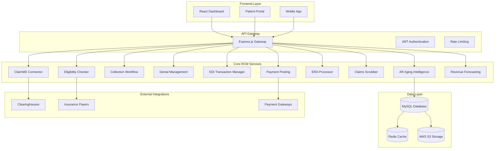
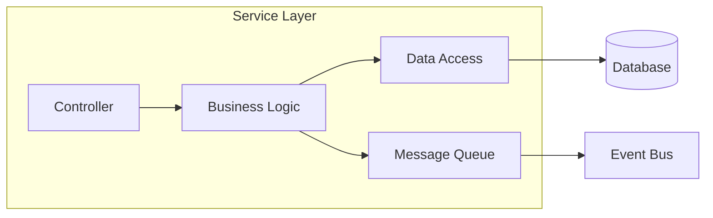
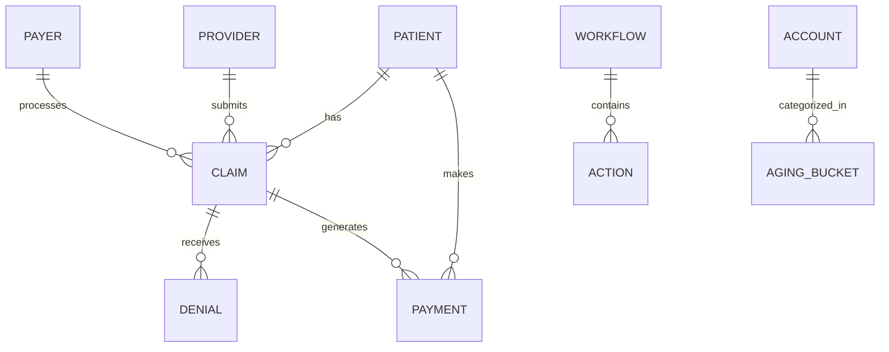

# Design Document

## Overview

The RCM Advanced Workflow system is a comprehensive, AI-powered revenue cycle management platform that integrates multiple advanced components to automate and optimize the entire medical billing process. The system leverages machine learning algorithms, real-time data processing, and intelligent automation to minimize claim denials, accelerate payment cycles, and maximize revenue recovery.

The architecture follows a microservices approach with event-driven communication, ensuring scalability, maintainability, and real-time processing capabilities. Each component operates independently while seamlessly integrating with others through well-defined APIs and message queues.

## Architecture

### High-Level Architecture



### Service Architecture Pattern

Each RCM service follows a consistent architecture pattern:



## Components and Interfaces

### 1. AR Aging Intelligence System

**Purpose**: Intelligent analysis and prioritization of accounts receivable

**Core Components**:
- **ML Prediction Engine**: Predicts collection probability using historical data
- **Risk Scoring Algorithm**: Assigns risk scores based on multiple factors
- **Automated Workflow Triggers**: Initiates collection actions based on thresholds
- **Interactive Dashboard**: Provides drill-down analytics and visualizations

**Key Interfaces**:
```typescript
interface ARAgingIntelligence {
  analyzeARAccounts(filters: ARFilters): Promise<ARAnalysisResult>;
  predictCollectionProbability(accountId: number): Promise<PredictionResult>;
  generateRiskScores(accounts: Account[]): Promise<RiskScore[]>;
  triggerAutomatedActions(thresholds: ActionThreshold[]): Promise<ActionResult[]>;
}

interface ARAnalysisResult {
  agingBuckets: AgingBucket[];
  totalOutstanding: number;
  collectionProbability: number;
  recommendedActions: RecommendedAction[];
  riskDistribution: RiskDistribution;
}
```

**Database Schema**:
- `rcm_ar_aging_analysis` - Aging analysis results
- `rcm_collection_predictions` - ML prediction results
- `rcm_risk_scores` - Account risk assessments
- `rcm_automated_actions` - Triggered actions log

### 2. ClaimMD Connector Integration

**Purpose**: Seamless integration with ClaimMD clearinghouse services

**Core Components**:
- **API Client**: Handles ClaimMD API communication
- **Data Transformer**: Converts internal data to ClaimMD format
- **Status Synchronizer**: Real-time claim status updates
- **Error Handler**: Manages transmission errors and retries

**Key Interfaces**:
```typescript
interface ClaimMDConnector {
  submitClaim(claim: Claim): Promise<SubmissionResult>;
  getClaimStatus(claimId: string): Promise<ClaimStatus>;
  downloadERA(eraId: string): Promise<ERAFile>;
  validateClaim(claim: Claim): Promise<ValidationResult>;
}

interface SubmissionResult {
  claimMDId: string;
  status: 'submitted' | 'rejected' | 'pending';
  confirmationNumber: string;
  errors: ValidationError[];
}
```

**Database Schema**:
- `rcm_claimmd_submissions` - Submission tracking
- `rcm_claimmd_responses` - Response logging
- `rcm_claimmd_errors` - Error tracking
- `rcm_claimmd_mappings` - Data mapping configurations

### 3. Collection Workflow Manager

**Purpose**: Automated patient collection process management

**Core Components**:
- **Workflow Engine**: Manages collection process stages
- **Statement Generator**: Creates personalized patient statements
- **Communication Manager**: Handles automated communications
- **Payment Plan Manager**: Manages payment plan setups

**Key Interfaces**:
```typescript
interface CollectionWorkflowManager {
  initiateWorkflow(accountId: number): Promise<WorkflowInstance>;
  generateStatement(accountId: number, template: StatementTemplate): Promise<Statement>;
  scheduleFollowUp(accountId: number, action: FollowUpAction): Promise<ScheduleResult>;
  setupPaymentPlan(accountId: number, plan: PaymentPlan): Promise<PaymentPlanResult>;
}

interface WorkflowInstance {
  id: string;
  accountId: number;
  currentStage: WorkflowStage;
  nextActions: ScheduledAction[];
  completionStatus: number;
}
```

**Database Schema**:
- `rcm_collection_workflows` - Workflow instances
- `rcm_collection_stages` - Workflow stage definitions
- `rcm_collection_actions` - Scheduled and completed actions
- `rcm_payment_plans` - Payment plan configurations

### 4. Denial Management Workflow

**Purpose**: Intelligent denial processing and appeal management

**Core Components**:
- **Denial Categorizer**: Automatically categorizes denials by reason
- **Resolution Engine**: Suggests resolution actions based on denial type
- **Appeal Generator**: Creates appeal letters with supporting documentation
- **Outcome Tracker**: Tracks appeal results and success rates

**Key Interfaces**:
```typescript
interface DenialManagementWorkflow {
  categorizeDenial(denial: Denial): Promise<DenialCategory>;
  suggestResolution(denial: Denial): Promise<ResolutionSuggestion[]>;
  generateAppeal(denialId: number, appealType: AppealType): Promise<AppealDocument>;
  trackOutcome(appealId: number, outcome: AppealOutcome): Promise<void>;
}

interface ResolutionSuggestion {
  action: string;
  priority: number;
  successRate: number;
  estimatedRecovery: number;
  requiredDocuments: string[];
}
```

**Database Schema**:
- `rcm_denial_categories` - Denial categorization
- `rcm_denial_resolutions` - Resolution tracking
- `rcm_appeal_documents` - Generated appeals
- `rcm_appeal_outcomes` - Appeal results

### 5. EDI Transaction Manager

**Purpose**: Comprehensive EDI transaction processing and validation

**Core Components**:
- **Transaction Parser**: Parses various EDI transaction types
- **Validation Engine**: Validates syntax and business rules
- **Transmission Manager**: Handles secure EDI transmission
- **Compliance Monitor**: Ensures EDI standard compliance

**Key Interfaces**:
```typescript
interface EDITransactionManager {
  parseTransaction(ediContent: string, transactionType: EDIType): Promise<ParsedTransaction>;
  validateTransaction(transaction: ParsedTransaction): Promise<ValidationResult>;
  transmitTransaction(transaction: EDITransaction): Promise<TransmissionResult>;
  monitorCompliance(transactions: EDITransaction[]): Promise<ComplianceReport>;
}

interface ParsedTransaction {
  transactionType: EDIType;
  controlNumber: string;
  segments: EDISegment[];
  businessData: any;
  validationErrors: ValidationError[];
}
```

**Database Schema**:
- `rcm_edi_transactions` - Transaction log
- `rcm_edi_validation_rules` - Validation rule definitions
- `rcm_edi_transmission_log` - Transmission tracking
- `rcm_edi_compliance_reports` - Compliance monitoring

### 6. Enhanced Eligibility Checker

**Purpose**: Real-time insurance eligibility verification with comprehensive coverage details

**Core Components**:
- **Multi-Payer Interface**: Connects to multiple payer systems
- **Coverage Analyzer**: Analyzes coverage details and limitations
- **Prior Auth Manager**: Handles prior authorization requirements
- **Cache Manager**: Optimizes performance with intelligent caching

**Key Interfaces**:
```typescript
interface EnhancedEligibilityChecker {
  checkEligibility(patient: Patient, insurance: Insurance, services: Service[]): Promise<EligibilityResult>;
  getCoverageDetails(eligibilityId: string): Promise<CoverageDetails>;
  checkPriorAuth(service: Service, patient: Patient): Promise<PriorAuthResult>;
  cacheEligibility(eligibilityResult: EligibilityResult): Promise<void>;
}

interface EligibilityResult {
  eligible: boolean;
  coverageLevel: CoverageLevel;
  copayAmount: number;
  deductibleInfo: DeductibleInfo;
  priorAuthRequired: boolean;
  coverageLimitations: Limitation[];
}
```

**Database Schema**:
- `rcm_eligibility_requests` - Eligibility check requests
- `rcm_eligibility_cache` - Cached eligibility results
- `rcm_coverage_details` - Detailed coverage information
- `rcm_prior_auth_requirements` - Prior authorization tracking

### 7. ERA Processor

**Purpose**: Automated Electronic Remittance Advice processing and payment posting

**Core Components**:
- **ERA Parser**: Parses ERA files from multiple formats
- **Payment Matcher**: Matches payments to claims using advanced algorithms
- **Auto-Posting Engine**: Automatically posts payments and adjustments
- **Variance Analyzer**: Identifies and reports payment discrepancies

**Key Interfaces**:
```typescript
interface ERAProcessor {
  processERAFile(eraFile: File): Promise<ERAProcessingResult>;
  matchPayments(eraData: ERAData): Promise<PaymentMatch[]>;
  postPayments(matches: PaymentMatch[]): Promise<PostingResult>;
  analyzeVariances(postingResults: PostingResult[]): Promise<VarianceReport>;
}

interface ERAProcessingResult {
  totalPayments: number;
  matchedPayments: number;
  unmatchedPayments: number;
  adjustments: Adjustment[];
  denials: Denial[];
  variances: Variance[];
}
```

**Database Schema**:
- `rcm_era_files` - ERA file processing log
- `rcm_payment_matches` - Payment matching results
- `rcm_posting_results` - Payment posting outcomes
- `rcm_variance_reports` - Variance analysis

### 8. Intelligent Claims Scrubbers

**Purpose**: AI-powered pre-submission claim validation and correction

**Core Components**:
- **Validation Engine**: Comprehensive claim validation
- **AI Correction Engine**: Machine learning-based error correction
- **Quality Scorer**: Assigns quality scores to claims
- **Learning System**: Continuously improves from denial patterns

**Key Interfaces**:
```typescript
interface IntelligentClaimsScrubber {
  scrubClaim(claim: Claim): Promise<ScrubResult>;
  suggestCorrections(errors: ValidationError[]): Promise<CorrectionSuggestion[]>;
  scoreClaimQuality(claim: Claim): Promise<QualityScore>;
  learnFromDenials(denials: Denial[]): Promise<LearningResult>;
}

interface ScrubResult {
  passed: boolean;
  qualityScore: number;
  errors: ValidationError[];
  corrections: AutoCorrection[];
  riskLevel: RiskLevel;
}
```

**Database Schema**:
- `rcm_claim_validations` - Validation results
- `rcm_auto_corrections` - Applied corrections
- `rcm_quality_scores` - Claim quality assessments
- `rcm_learning_patterns` - ML learning data

### 9. Patient Financial Portal

**Purpose**: Self-service patient financial management portal

**Core Components**:
- **Account Dashboard**: Patient account overview
- **Payment Processor**: Multi-method payment processing
- **Communication Center**: Secure messaging with billing staff
- **Document Manager**: Statement and document access

**Key Interfaces**:
```typescript
interface PatientFinancialPortal {
  getAccountSummary(patientId: number): Promise<AccountSummary>;
  processPayment(payment: PaymentRequest): Promise<PaymentResult>;
  setupPaymentPlan(planRequest: PaymentPlanRequest): Promise<PaymentPlan>;
  sendMessage(message: PatientMessage): Promise<MessageResult>;
}

interface AccountSummary {
  currentBalance: number;
  paymentHistory: Payment[];
  statements: Statement[];
  paymentPlans: PaymentPlan[];
  messages: Message[];
}
```

**Database Schema**:
- `rcm_patient_accounts` - Patient account summaries
- `rcm_patient_payments` - Payment history
- `rcm_patient_messages` - Communication log
- `rcm_patient_documents` - Document access log

### 10. Payment Posting Engine

**Purpose**: Automated payment posting with complex scenario handling

**Core Components**:
- **Payment Identifier**: Identifies payment sources and types
- **Allocation Engine**: Allocates payments to correct accounts
- **Adjustment Processor**: Handles insurance adjustments
- **Overpayment Manager**: Manages overpayment scenarios

**Key Interfaces**:
```typescript
interface PaymentPostingEngine {
  identifyPayment(payment: IncomingPayment): Promise<PaymentIdentification>;
  allocatePayment(payment: IdentifiedPayment): Promise<AllocationResult>;
  processAdjustments(adjustments: Adjustment[]): Promise<AdjustmentResult>;
  handleOverpayment(overpayment: Overpayment): Promise<OverpaymentResult>;
}

interface AllocationResult {
  allocatedAmount: number;
  remainingBalance: number;
  adjustments: Adjustment[];
  patientResponsibility: number;
}
```

**Database Schema**:
- `rcm_payment_postings` - Payment posting log
- `rcm_payment_allocations` - Payment allocation details
- `rcm_adjustments` - Insurance adjustments
- `rcm_overpayments` - Overpayment tracking

### 11. Revenue Forecasting System

**Purpose**: Predictive revenue analytics and cash flow forecasting

**Core Components**:
- **Forecasting Engine**: Machine learning-based revenue predictions
- **Trend Analyzer**: Identifies revenue patterns and trends
- **Scenario Modeler**: Models different business scenarios
- **Dashboard Generator**: Creates interactive forecasting dashboards

**Key Interfaces**:
```typescript
interface RevenueForecastingSystem {
  generateForecast(parameters: ForecastParameters): Promise<RevenueForecast>;
  analyzeTrends(timeframe: TimeFrame): Promise<TrendAnalysis>;
  modelScenario(scenario: BusinessScenario): Promise<ScenarioResult>;
  createDashboard(dashboardConfig: DashboardConfig): Promise<Dashboard>;
}

interface RevenueForecast {
  projectedRevenue: number;
  confidenceInterval: ConfidenceInterval;
  keyDrivers: RevenueDriver[];
  riskFactors: RiskFactor[];
  recommendations: Recommendation[];
}
```

**Database Schema**:
- `rcm_revenue_forecasts` - Forecast results
- `rcm_trend_analysis` - Trend analysis data
- `rcm_scenario_models` - Scenario modeling results
- `rcm_forecast_accuracy` - Forecast accuracy tracking

## Data Models

### Core Data Entities

```typescript
// Patient Account
interface PatientAccount {
  id: number;
  patientId: number;
  currentBalance: number;
  totalCharges: number;
  totalPayments: number;
  totalAdjustments: number;
  lastPaymentDate: Date;
  agingBucket: AgingBucket;
  riskScore: number;
  collectionStatus: CollectionStatus;
}

// Claim
interface Claim {
  id: number;
  claimNumber: string;
  patientId: number;
  providerId: number;
  payerId: number;
  totalAmount: number;
  paidAmount: number;
  deniedAmount: number;
  adjustmentAmount: number;
  claimStatus: ClaimStatus;
  submissionDate: Date;
  qualityScore: number;
  riskLevel: RiskLevel;
}

// Payment
interface Payment {
  id: number;
  paymentType: PaymentType;
  amount: number;
  paymentDate: Date;
  paymentMethod: PaymentMethod;
  source: PaymentSource;
  allocationDetails: AllocationDetail[];
  processingStatus: ProcessingStatus;
}

// Denial
interface Denial {
  id: number;
  claimId: number;
  denialCode: string;
  denialReason: string;
  deniedAmount: number;
  category: DenialCategory;
  resolutionStatus: ResolutionStatus;
  appealDeadline: Date;
  suggestedActions: string[];
}
```

### Relationship Mappings



## Error Handling

### Error Classification System

```typescript
enum ErrorSeverity {
  LOW = 'low',
  MEDIUM = 'medium',
  HIGH = 'high',
  CRITICAL = 'critical'
}

interface RCMError {
  code: string;
  message: string;
  severity: ErrorSeverity;
  component: string;
  context: any;
  timestamp: Date;
  retryable: boolean;
}
```

### Error Handling Strategies

1. **Transient Errors**: Automatic retry with exponential backoff
2. **Validation Errors**: Immediate user feedback with correction suggestions
3. **Integration Errors**: Circuit breaker pattern with fallback mechanisms
4. **Critical Errors**: Immediate alerting and manual intervention triggers

### Monitoring and Alerting

- **Real-time Error Tracking**: Comprehensive error logging and monitoring
- **Performance Metrics**: Response time, throughput, and success rate monitoring
- **Business Metrics**: Revenue impact, claim success rates, collection efficiency
- **Alert Thresholds**: Configurable thresholds for different error types and business metrics

## Testing Strategy

### Unit Testing
- **Service Layer Testing**: Comprehensive unit tests for all business logic
- **Data Layer Testing**: Repository pattern testing with mock databases
- **Utility Function Testing**: Testing of helper functions and utilities

### Integration Testing
- **API Integration Testing**: Testing of external API integrations
- **Database Integration Testing**: Testing of database operations and transactions
- **Message Queue Testing**: Testing of asynchronous message processing

### End-to-End Testing
- **Workflow Testing**: Complete workflow testing from claim submission to payment
- **User Journey Testing**: Testing of complete user interactions
- **Performance Testing**: Load testing and stress testing of critical paths

### Test Data Management
- **Synthetic Data Generation**: Automated generation of test data
- **Data Anonymization**: HIPAA-compliant test data creation
- **Test Environment Management**: Isolated test environments with controlled data

## Security and Compliance

### HIPAA Compliance
- **Data Encryption**: End-to-end encryption for all PHI
- **Access Controls**: Role-based access control with audit trails
- **Audit Logging**: Comprehensive audit logging for all data access
- **Data Retention**: Compliant data retention and deletion policies

### Security Measures
- **Authentication**: Multi-factor authentication for sensitive operations
- **Authorization**: Granular permission system
- **Data Validation**: Input validation and sanitization
- **Secure Communication**: TLS encryption for all communications

### Compliance Monitoring
- **Automated Compliance Checks**: Regular automated compliance validation
- **Audit Trail Management**: Immutable audit trail generation
- **Risk Assessment**: Regular security risk assessments
- **Incident Response**: Defined incident response procedures