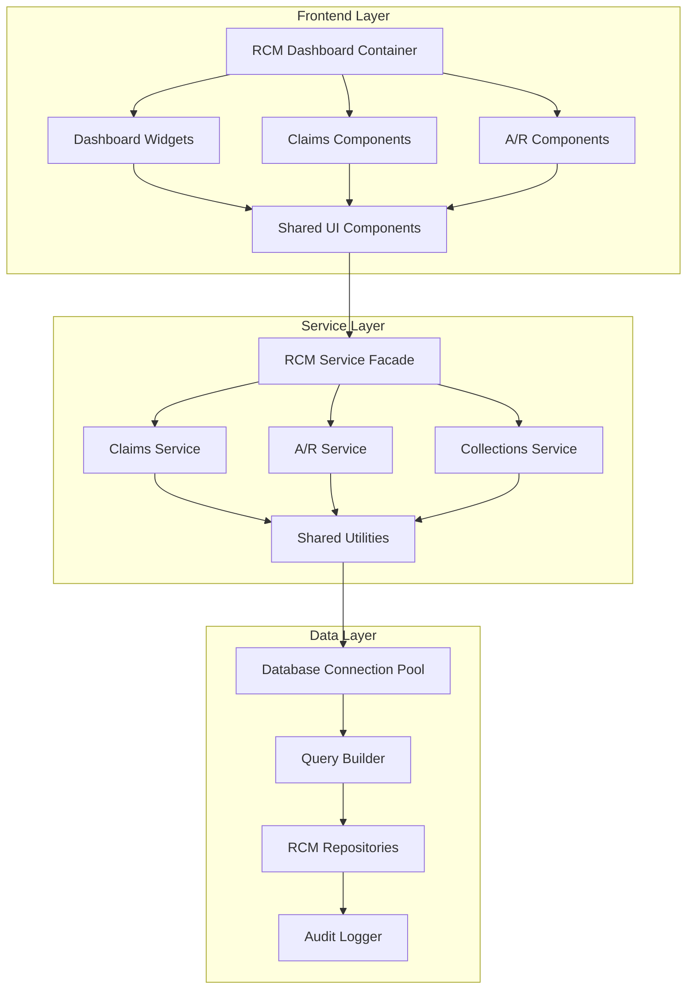

# RCM Module Code Review & Refactoring Design

## Overview

This design document outlines the comprehensive refactoring approach for the Revenue Cycle Management (RCM) module to eliminate code duplication, improve frontend quality, standardize backend patterns, and enhance overall maintainability. The refactoring will be implemented in phases to minimize risk and ensure system stability.

## Architecture

### Current State Analysis

**Backend Issues Identified:**
- Multiple database connection patterns across services
- Duplicate utility functions (`formatCurrency`, `formatDate`, etc.)
- Inconsistent error handling and response formats
- Mixed transaction management approaches
- Duplicate validation logic across controllers

**Frontend Issues Identified:**
- Large monolithic components (e.g., `RCMDashboard.tsx` - 800+ lines)
- Duplicate UI imports and patterns across components
- Inconsistent state management and data fetching
- Missing TypeScript interfaces and proper error handling
- Performance issues with unnecessary re-renders

### Target Architecture



## Components and Interfaces

### 1. Shared Utilities Layer

**File: `server/utils/rcmUtils.js`**
```javascript
// Consolidated utility functions
const formatCurrency = (amount) => { /* implementation */ };
const formatDate = (dateString, format = 'MM/DD/YYYY') => { /* implementation */ };
const calculateDaysInAR = (serviceDate, currentDate) => { /* implementation */ };
const validateClaimData = (claimData) => { /* implementation */ };
```

**File: `server/utils/dbUtils.js`**
```javascript
// Database connection and query utilities
const getConnection = async () => { /* connection pool */ };
const executeQuery = async (query, params) => { /* with error handling */ };
const executeTransaction = async (queries) => { /* atomic transactions */ };
```

**File: `src/utils/rcmFormatters.ts`**
```typescript
// Frontend formatting utilities
export const formatCurrency = (amount: number): string => { /* implementation */ };
export const formatDate = (date: string | Date): string => { /* implementation */ };
export const getStatusBadgeProps = (status: number): BadgeProps => { /* implementation */ };
```

### 2. Backend Service Layer Refactoring

**File: `server/services/rcm/rcmService.js`** (New Service Facade)
```javascript
class RCMService {
  constructor() {
    this.claimsService = new ClaimsService();
    this.arService = new ARService();
    this.collectionsService = new CollectionsService();
  }
  
  async getDashboardData(userId, timeframe) {
    // Orchestrate data from multiple services
  }
}
```

**Standardized Controller Pattern:**
```javascript
const standardController = (serviceMethod) => async (req, res) => {
  try {
    const result = await serviceMethod(req.params, req.query, req.body, req.user);
    res.json({
      success: true,
      data: result.data,
      pagination: result.pagination,
      metadata: result.metadata
    });
  } catch (error) {
    handleControllerError(error, res);
  }
};
```

### 3. Frontend Component Architecture

**Component Hierarchy:**
```
RCMDashboard (Container)
├── DashboardHeader
├── KPICards
│   ├── RevenueCard
│   ├── CollectionRateCard
│   ├── DenialRateCard
│   └── ARDaysCard
├── ChartsSection
│   ├── RevenueChart
│   ├── ClaimsChart
│   └── PaymentChart
└── ActionItems
```

**Shared Component Library:**
```typescript
// src/components/rcm/shared/
export { KPICard } from './KPICard';
export { StatusBadge } from './StatusBadge';
export { CurrencyDisplay } from './CurrencyDisplay';
export { DateDisplay } from './DateDisplay';
export { LoadingSpinner } from './LoadingSpinner';
export { ErrorBoundary } from './ErrorBoundary';
```

### 4. State Management Standardization

**Redux Slice Structure:**
```typescript
// src/redux/slices/rcmSlice.ts
interface RCMState {
  dashboard: {
    data: DashboardData | null;
    loading: boolean;
    error: string | null;
    lastUpdated: string | null;
  };
  claims: {
    list: Claim[];
    filters: ClaimFilters;
    pagination: Pagination;
    loading: boolean;
    error: string | null;
  };
  // ... other sections
}
```

**Custom Hooks:**
```typescript
// src/hooks/useRCMData.ts
export const useRCMDashboard = (timeframe: string) => {
  // Centralized data fetching with caching
};

export const useClaims = (filters: ClaimFilters) => {
  // Claims data with pagination and filtering
};
```

## Data Models

### 1. Standardized Response Format

```typescript
interface APIResponse<T> {
  success: boolean;
  data: T;
  pagination?: {
    total: number;
    page: number;
    limit: number;
    totalPages: number;
  };
  metadata?: {
    timestamp: string;
    version: string;
    [key: string]: any;
  };
  error?: {
    code: string;
    message: string;
    details?: any;
  };
}
```

### 2. RCM Domain Models

```typescript
interface Claim {
  id: number;
  patientId: number;
  patientName: string;
  serviceDate: string;
  submissionDate: string;
  status: ClaimStatus;
  procedureCode: string;
  totalAmount: number;
  paidAmount: number;
  trackingId?: string;
  payerName?: string;
  processingDays: number;
  priority: Priority;
}

interface ARAccount {
  accountId: number;
  patientId: number;
  patientName: string;
  balance: number;
  aging: {
    days0to30: number;
    days31to60: number;
    days61to90: number;
    days91to120: number;
    days120Plus: number;
  };
  collectabilityScore: number;
  recommendedAction: string;
  lastContactDate?: string;
}
```

## Error Handling

### 1. Backend Error Handling

```javascript
// server/middleware/errorHandler.js
class AppError extends Error {
  constructor(message, statusCode, code) {
    super(message);
    this.statusCode = statusCode;
    this.code = code;
    this.isOperational = true;
  }
}

const handleControllerError = (error, res) => {
  if (error.isOperational) {
    return res.status(error.statusCode).json({
      success: false,
      error: {
        code: error.code,
        message: error.message
      }
    });
  }
  
  // Log unexpected errors
  logger.error('Unexpected error:', error);
  
  res.status(500).json({
    success: false,
    error: {
      code: 'INTERNAL_SERVER_ERROR',
      message: 'An unexpected error occurred'
    }
  });
};
```

### 2. Frontend Error Handling

```typescript
// src/components/rcm/shared/ErrorBoundary.tsx
class RCMErrorBoundary extends React.Component<Props, State> {
  // Error boundary implementation with fallback UI
}

// src/hooks/useErrorHandler.ts
export const useErrorHandler = () => {
  const dispatch = useAppDispatch();
  
  return useCallback((error: Error, context: string) => {
    // Centralized error handling and user notification
  }, [dispatch]);
};
```

## Testing Strategy

### 1. Backend Testing

**Unit Tests:**
- Test utility functions in isolation
- Test service methods with mocked dependencies
- Test controller error handling

**Integration Tests:**
- Test API endpoints with real database
- Test transaction rollback scenarios
- Test authentication and authorization

**Example Test Structure:**
```javascript
// tests/services/rcm/rcmService.test.js
describe('RCMService', () => {
  describe('getDashboardData', () => {
    it('should return dashboard data for valid user', async () => {
      // Test implementation
    });
    
    it('should handle database connection errors', async () => {
      // Test error scenarios
    });
  });
});
```

### 2. Frontend Testing

**Component Tests:**
- Test component rendering with different props
- Test user interactions and state changes
- Test error states and loading states

**Hook Tests:**
- Test custom hooks with different scenarios
- Test data fetching and caching behavior
- Test error handling in hooks

**Example Test Structure:**
```typescript
// src/components/rcm/__tests__/RCMDashboard.test.tsx
describe('RCMDashboard', () => {
  it('should render loading state initially', () => {
    // Test implementation
  });
  
  it('should display dashboard data when loaded', () => {
    // Test implementation
  });
  
  it('should handle API errors gracefully', () => {
    // Test implementation
  });
});
```

## Performance Optimizations

### 1. Database Optimizations

- **Connection Pooling:** Implement proper connection pool management
- **Query Optimization:** Add indexes for frequently queried columns
- **Pagination:** Implement cursor-based pagination for large datasets
- **Caching:** Add Redis caching for frequently accessed data

### 2. Frontend Optimizations

- **Code Splitting:** Lazy load RCM components
- **Memoization:** Use React.memo and useMemo for expensive calculations
- **Virtual Scrolling:** Implement for large data tables
- **Bundle Optimization:** Tree shake unused dependencies

### 3. API Optimizations

- **Response Compression:** Enable gzip compression
- **Caching Headers:** Set appropriate cache headers
- **Rate Limiting:** Implement rate limiting for API endpoints
- **Data Aggregation:** Combine multiple API calls where possible

## Security Considerations

### 1. Input Validation

```javascript
// server/middleware/validation.js
const validateClaimData = (req, res, next) => {
  const schema = Joi.object({
    patientId: Joi.number().required(),
    procedureCode: Joi.string().pattern(/^[0-9]{5}$/).required(),
    amount: Joi.number().positive().required()
  });
  
  const { error } = schema.validate(req.body);
  if (error) {
    return res.status(400).json({
      success: false,
      error: {
        code: 'VALIDATION_ERROR',
        message: error.details[0].message
      }
    });
  }
  
  next();
};
```

### 2. Data Sanitization

- Sanitize all user inputs to prevent SQL injection
- Implement proper parameterized queries
- Validate and sanitize file uploads
- Implement CSRF protection

### 3. Access Control

- Verify user permissions for each RCM operation
- Implement role-based access control
- Log all sensitive operations for audit trails
- Implement session management and timeout

## Migration Strategy

### Phase 1: Backend Utilities (Week 1-2)
1. Create shared utility functions
2. Implement standardized database connection handling
3. Create common error handling middleware
4. Update existing services to use new utilities

### Phase 2: Service Layer Refactoring (Week 3-4)
1. Refactor RCM controllers to use service pattern
2. Implement standardized response formats
3. Add comprehensive input validation
4. Implement proper transaction handling

### Phase 3: Frontend Component Refactoring (Week 5-6)
1. Break down large components into smaller ones
2. Create shared component library
3. Implement custom hooks for data fetching
4. Add proper TypeScript interfaces

### Phase 4: Performance & Testing (Week 7-8)
1. Implement performance optimizations
2. Add comprehensive test coverage
3. Implement monitoring and logging
4. Conduct security audit and fixes

Each phase will include:
- Code review checkpoints
- Testing validation
- Performance benchmarking
- Documentation updates
- Rollback procedures if needed