# RCM Module Architecture Documentation

This document provides a comprehensive overview of the RCM (Revenue Cycle Management) module architecture, including system design, component relationships, and data flow patterns.

## Table of Contents

1. [System Overview](#system-overview)
2. [Architecture Principles](#architecture-principles)
3. [High-Level Architecture](#high-level-architecture)
4. [Frontend Architecture](#frontend-architecture)
5. [Backend Architecture](#backend-architecture)
6. [Database Architecture](#database-architecture)
7. [API Design](#api-design)
8. [Security Architecture](#security-architecture)
9. [Performance Architecture](#performance-architecture)
10. [Deployment Architecture](#deployment-architecture)

## System Overview

The RCM module is a comprehensive healthcare revenue cycle management system that handles the complete billing workflow from patient registration to payment collection. It's built using a modern, scalable architecture with clear separation of concerns.

### Key Components

- **Frontend**: React-based SPA with TypeScript
- **Backend**: Node.js/Express API server
- **Database**: MySQL with optimized schemas
- **Cache**: Redis for session and data caching
- **Monitoring**: Prometheus + Grafana stack
- **Security**: JWT-based authentication with RBAC

## Architecture Principles

### 1. Separation of Concerns
- Clear boundaries between presentation, business logic, and data layers
- Modular design with focused responsibilities

### 2. Scalability
- Horizontal scaling capabilities
- Stateless service design
- Efficient caching strategies

### 3. Maintainability
- Clean code principles
- Comprehensive testing
- Clear documentation

### 4. Security
- Defense in depth
- Principle of least privilege
- Data encryption and validation

### 5. Performance
- Optimized database queries
- Efficient caching
- Lazy loading and code splitting

## High-Level Architecture

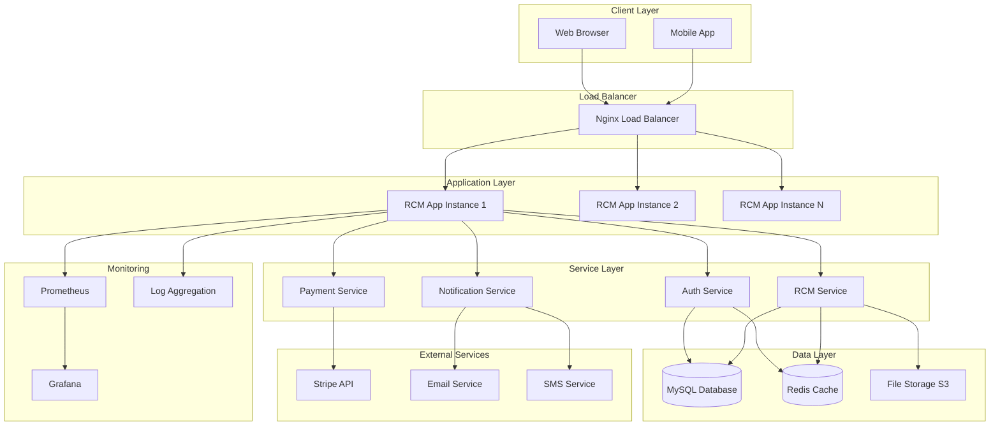

## Frontend Architecture

### Component Architecture

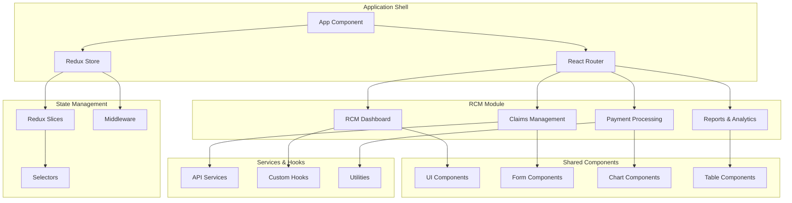

### Data Flow Pattern

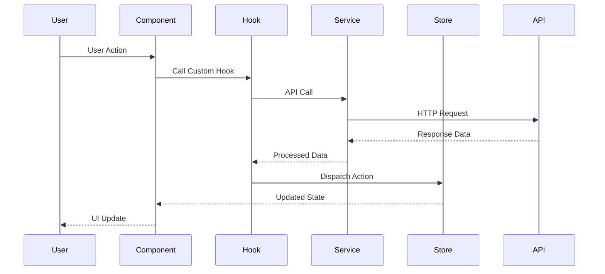

### Component Structure

```
src/components/rcm/
├── dashboard/
│   ├── RCMDashboard.tsx          # Main dashboard container
│   ├── KPISection.tsx            # Key performance indicators
│   ├── ChartsSection.tsx         # Revenue charts
│   └── RecentActivity.tsx        # Recent claims/payments
├── claims/
│   ├── ClaimsList.tsx            # Claims listing
│   ├── ClaimForm.tsx             # Claim creation/editing
│   ├── ClaimDetails.tsx          # Claim detail view
│   └── ClaimStatusBadge.tsx      # Status indicator
├── payments/
│   ├── PaymentsList.tsx          # Payments listing
│   ├── PaymentForm.tsx           # Payment processing
│   └── PaymentHistory.tsx        # Payment history
└── shared/
    ├── KPICard.tsx               # Reusable KPI card
    ├── StatusBadge.tsx           # Status indicators
    ├── CurrencyDisplay.tsx       # Currency formatting
    └── LoadingSpinner.tsx        # Loading states
```

## Backend Architecture

### Service Layer Architecture

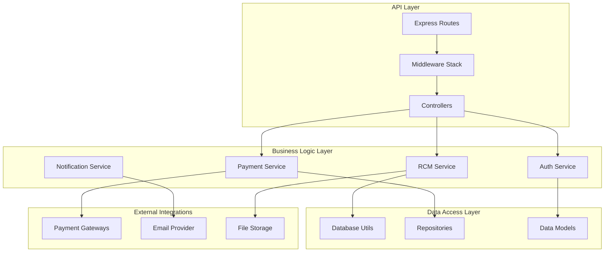

### Request Processing Flow

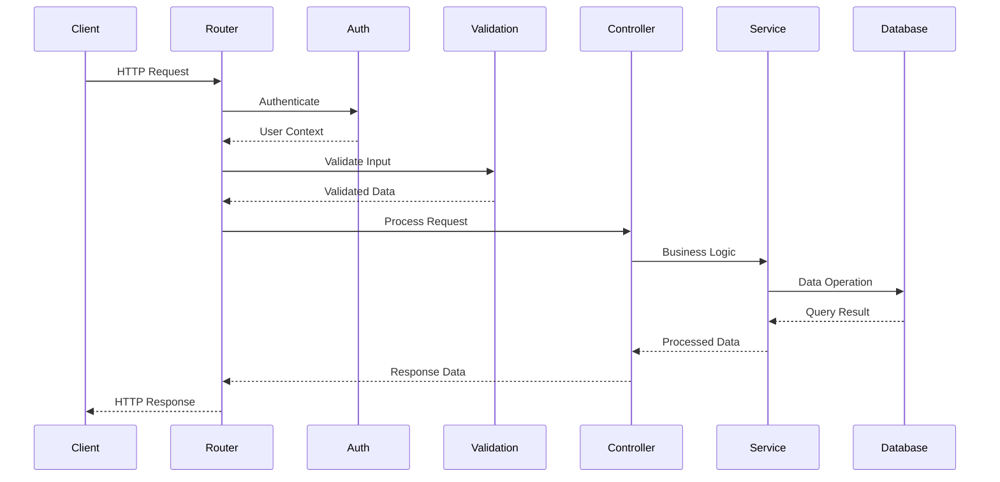

### Service Structure

```
server/services/rcm/
├── rcmService.js                 # Main RCM business logic
├── claimService.js               # Claim processing
├── paymentService.js             # Payment handling
├── reportService.js              # Analytics and reporting
└── validationService.js         # Data validation
```

## Database Architecture

### Entity Relationship Diagram

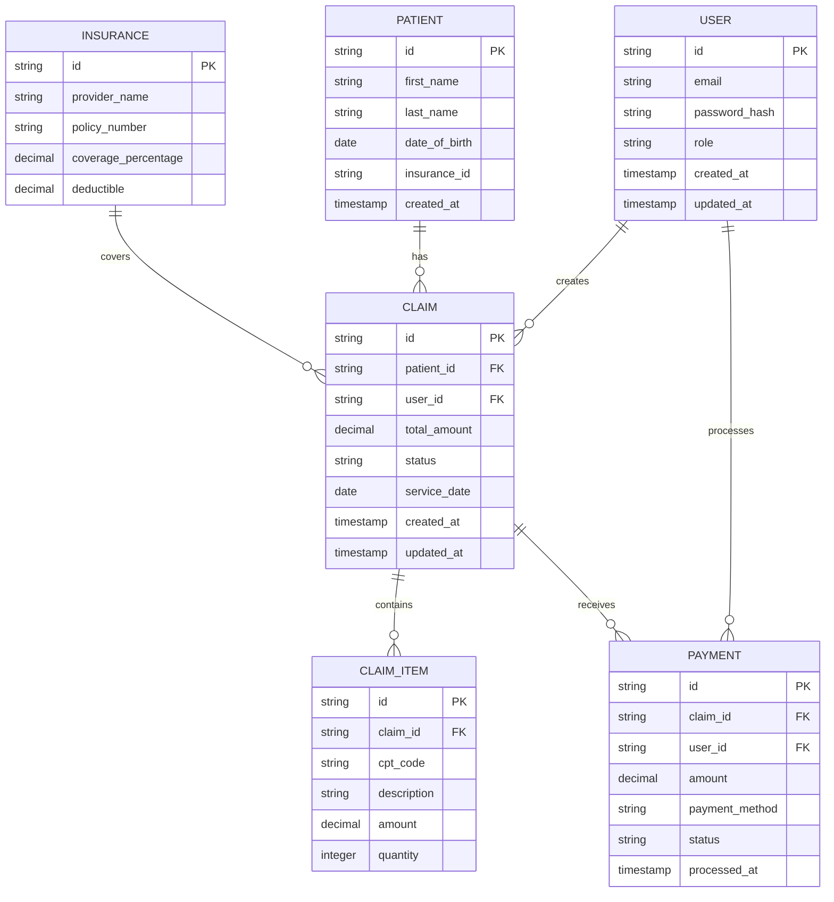

### Database Schema Design

```sql
-- Claims table with optimized indexing
CREATE TABLE claim (
    id VARCHAR(36) PRIMARY KEY,
    patient_id VARCHAR(36) NOT NULL,
    user_id VARCHAR(36) NOT NULL,
    total_amount DECIMAL(10,2) NOT NULL,
    status ENUM('draft', 'submitted', 'approved', 'denied', 'paid') NOT NULL DEFAULT 'draft',
    service_date DATE NOT NULL,
    created_at TIMESTAMP DEFAULT CURRENT_TIMESTAMP,
    updated_at TIMESTAMP DEFAULT CURRENT_TIMESTAMP ON UPDATE CURRENT_TIMESTAMP,
    deleted_at TIMESTAMP NULL,
    
    INDEX idx_claim_status (status),
    INDEX idx_claim_patient (patient_id),
    INDEX idx_claim_user (user_id),
    INDEX idx_claim_service_date (service_date),
    INDEX idx_claim_created (created_at),
    
    FOREIGN KEY (patient_id) REFERENCES patient(id),
    FOREIGN KEY (user_id) REFERENCES user(id)
);

-- Payments table with transaction support
CREATE TABLE payment (
    id VARCHAR(36) PRIMARY KEY,
    claim_id VARCHAR(36) NOT NULL,
    user_id VARCHAR(36) NOT NULL,
    amount DECIMAL(10,2) NOT NULL,
    payment_method ENUM('credit_card', 'bank_transfer', 'check', 'cash') NOT NULL,
    status ENUM('pending', 'completed', 'failed', 'refunded') NOT NULL DEFAULT 'pending',
    transaction_id VARCHAR(255),
    processed_at TIMESTAMP NULL,
    created_at TIMESTAMP DEFAULT CURRENT_TIMESTAMP,
    
    INDEX idx_payment_claim (claim_id),
    INDEX idx_payment_status (status),
    INDEX idx_payment_processed (processed_at),
    
    FOREIGN KEY (claim_id) REFERENCES claim(id),
    FOREIGN KEY (user_id) REFERENCES user(id)
);
```

## API Design

### RESTful API Structure

```
/api/v1/rcm/
├── claims/
│   ├── GET    /                  # List claims
│   ├── POST   /                  # Create claim
│   ├── GET    /:id               # Get claim details
│   ├── PUT    /:id               # Update claim
│   ├── DELETE /:id               # Delete claim
│   └── POST   /:id/submit        # Submit claim
├── payments/
│   ├── GET    /                  # List payments
│   ├── POST   /                  # Process payment
│   ├── GET    /:id               # Get payment details
│   └── POST   /:id/refund        # Refund payment
├── reports/
│   ├── GET    /dashboard         # Dashboard data
│   ├── GET    /revenue           # Revenue analytics
│   └── GET    /aging             # A/R aging report
└── settings/
    ├── GET    /                  # Get RCM settings
    └── PUT    /                  # Update settings
```

### API Response Format

```json
{
  "success": true,
  "data": {
    "id": "claim-123",
    "patientName": "John Doe",
    "amount": 1500.00,
    "status": "approved"
  },
  "meta": {
    "timestamp": "2024-01-15T10:30:00Z",
    "version": "1.0",
    "requestId": "req-456"
  },
  "pagination": {
    "page": 1,
    "limit": 20,
    "total": 150,
    "totalPages": 8
  }
}
```

## Security Architecture

### Authentication Flow

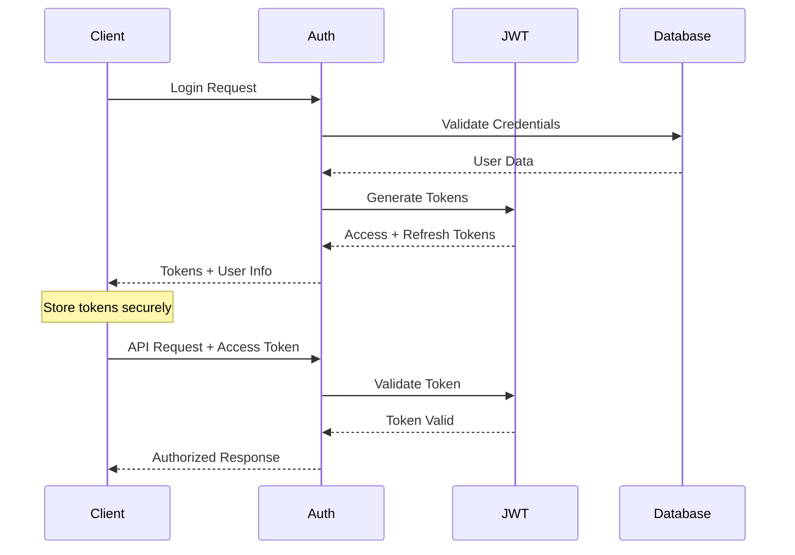

### Security Layers

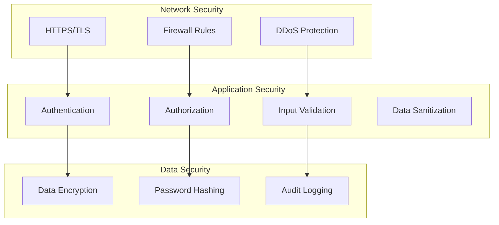

## Performance Architecture

### Caching Strategy

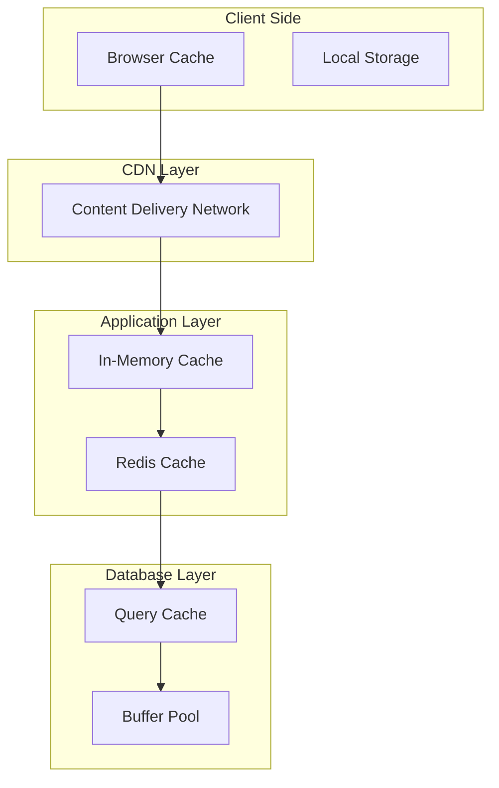

### Performance Optimization

1. **Database Optimization**
   - Proper indexing strategy
   - Query optimization
   - Connection pooling
   - Read replicas for reporting

2. **Application Optimization**
   - Code splitting and lazy loading
   - Component memoization
   - Efficient state management
   - API response caching

3. **Infrastructure Optimization**
   - Load balancing
   - Auto-scaling
   - CDN for static assets
   - Database sharding (future)

## Deployment Architecture

### Container Architecture

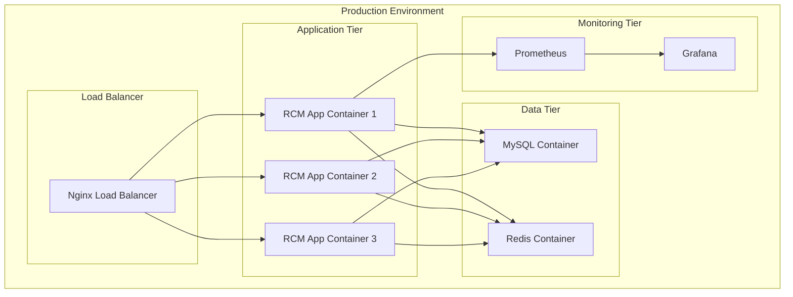

### Kubernetes Deployment

```yaml
# Example Kubernetes deployment structure
apiVersion: apps/v1
kind: Deployment
metadata:
  name: rcm-app
spec:
  replicas: 3
  selector:
    matchLabels:
      app: rcm-app
  template:
    metadata:
      labels:
        app: rcm-app
    spec:
      containers:
      - name: rcm-app
        image: rcm-app:latest
        ports:
        - containerPort: 3000
        resources:
          requests:
            memory: "512Mi"
            cpu: "250m"
          limits:
            memory: "1Gi"
            cpu: "500m"
```

## Scalability Considerations

### Horizontal Scaling

1. **Stateless Application Design**
   - No server-side sessions
   - JWT-based authentication
   - External state storage (Redis)

2. **Database Scaling**
   - Read replicas for reporting
   - Connection pooling
   - Query optimization
   - Future: Database sharding

3. **Caching Strategy**
   - Multi-level caching
   - Cache invalidation strategies
   - CDN for static content

### Vertical Scaling

1. **Resource Optimization**
   - Memory usage optimization
   - CPU-intensive task optimization
   - I/O optimization

2. **Performance Monitoring**
   - Real-time metrics
   - Performance bottleneck identification
   - Capacity planning

## Future Architecture Considerations

### Microservices Migration

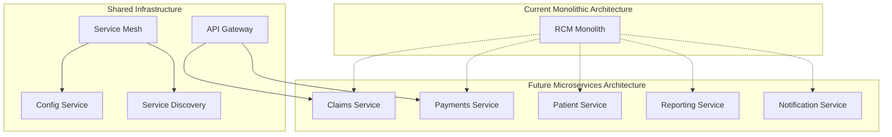

### Event-Driven Architecture

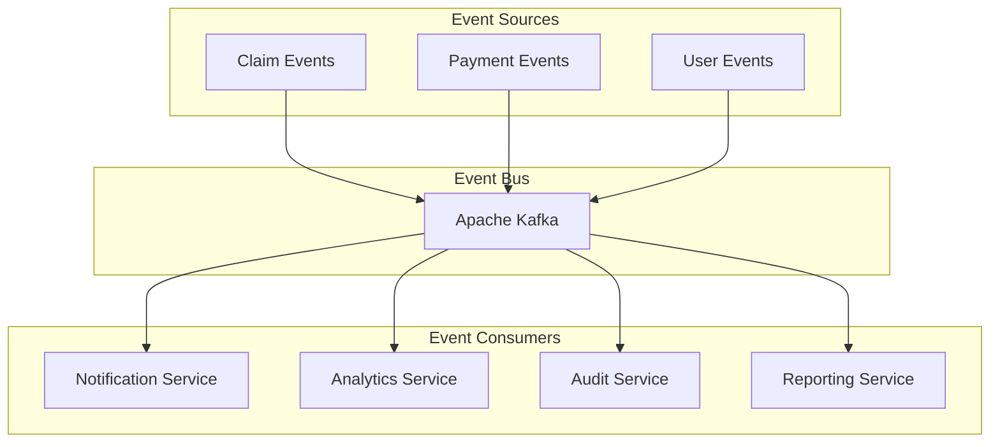

## Conclusion

This architecture provides:

- **Scalability**: Horizontal and vertical scaling capabilities
- **Maintainability**: Clear separation of concerns and modular design
- **Security**: Multiple layers of security controls
- **Performance**: Optimized for high throughput and low latency
- **Reliability**: Fault tolerance and disaster recovery
- **Flexibility**: Easy to extend and modify

The architecture is designed to evolve with business needs while maintaining stability and performance. Regular architecture reviews ensure the system continues to meet requirements as it scales.