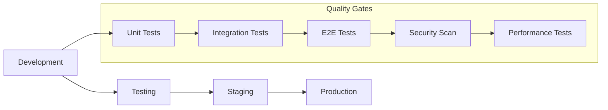
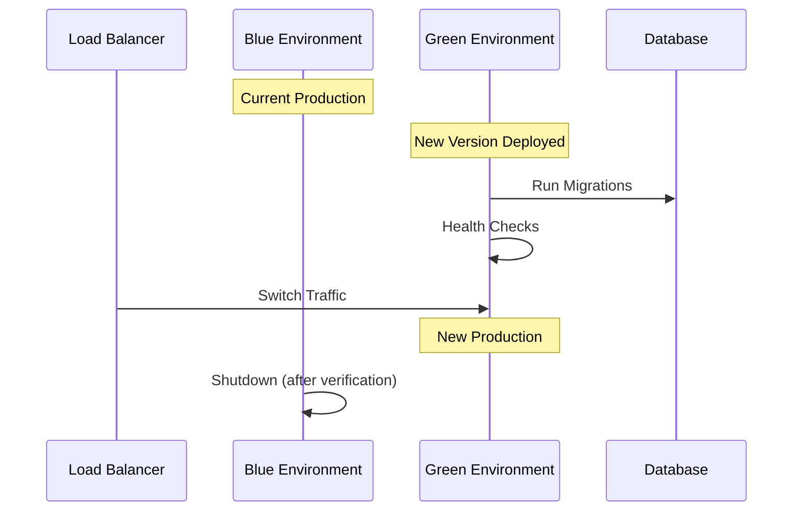

# RCM Module Deployment and Testing Procedures

This document outlines the comprehensive procedures for deploying and testing the RCM (Revenue Cycle Management) module across different environments.

## Table of Contents

1. [Overview](#overview)
2. [Pre-Deployment Procedures](#pre-deployment-procedures)
3. [Environment Setup](#environment-setup)
4. [Testing Procedures](#testing-procedures)
5. [Deployment Procedures](#deployment-procedures)
6. [Post-Deployment Procedures](#post-deployment-procedures)
7. [Rollback Procedures](#rollback-procedures)
8. [Monitoring and Maintenance](#monitoring-and-maintenance)

## Overview

### Deployment Pipeline



### Environment Types

- **Development**: Local development and feature testing
- **Testing**: Automated testing and QA validation
- **Staging**: Production-like environment for final validation
- **Production**: Live environment serving end users

## Pre-Deployment Procedures

### 1. Code Quality Checks

#### Automated Checks
```bash
# Run linting
npm run lint

# Run type checking
npm run type-check

# Run security audit
npm audit

# Check for outdated dependencies
npm outdated
```

#### Manual Checks
- [ ] Code review completed and approved
- [ ] All tests passing
- [ ] Documentation updated
- [ ] Security considerations reviewed
- [ ] Performance impact assessed

### 2. Version Management

#### Semantic Versioning
```bash
# For bug fixes
npm version patch

# For new features
npm version minor

# For breaking changes
npm version major
```

#### Git Tagging
```bash
# Create release tag
git tag -a v1.2.3 -m "Release version 1.2.3"
git push origin v1.2.3
```

### 3. Environment Configuration

#### Environment Variables Checklist
- [ ] Database connection strings
- [ ] API keys and secrets
- [ ] JWT secrets (minimum 64 characters for production)
- [ ] Redis configuration
- [ ] Email service configuration
- [ ] Payment gateway credentials
- [ ] Monitoring and logging configuration

#### Configuration Validation
```bash
# Validate environment configuration
node scripts/validate-config.js

# Test database connectivity
node scripts/test-db-connection.js

# Verify external service connectivity
node scripts/test-external-services.js
```

## Environment Setup

### Development Environment

#### Prerequisites
```bash
# Install Node.js (version 18+)
nvm install 18
nvm use 18

# Install dependencies
npm install

# Install Docker and Docker Compose
# (Platform-specific installation)

# Setup environment file
cp .env.development .env
```

#### Database Setup
```bash
# Start database container
docker-compose up -d rcm-db

# Run migrations
npm run migrate

# Seed test data
npm run seed:dev
```

#### Application Startup
```bash
# Start backend
cd server && npm run dev

# Start frontend (in another terminal)
npm run dev
```

### Testing Environment

#### Automated Setup
```bash
# Deploy to testing environment
./scripts/deploy.sh testing deploy

# Run database migrations
./scripts/deploy.sh testing migrate

# Seed test data
./scripts/deploy.sh testing seed
```

#### Manual Verification
- [ ] Application accessible at testing URL
- [ ] Database connectivity verified
- [ ] External services configured
- [ ] Monitoring endpoints responding

### Staging Environment

#### Deployment
```bash
# Deploy to staging
./scripts/deploy.sh staging deploy

# Verify deployment
./scripts/deploy.sh staging health

# Run smoke tests
npm run test:smoke:staging
```

#### Production-like Configuration
- [ ] SSL certificates configured
- [ ] Load balancer configured
- [ ] Monitoring and alerting active
- [ ] Backup procedures tested
- [ ] Security scanning completed

### Production Environment

#### Pre-deployment Checklist
- [ ] Staging environment fully tested
- [ ] Database backup created
- [ ] Rollback plan prepared
- [ ] Monitoring alerts configured
- [ ] Team notified of deployment
- [ ] Maintenance window scheduled (if required)

#### Deployment Process
```bash
# Create production backup
./scripts/deploy.sh production backup

# Deploy to production
./scripts/deploy.sh production deploy

# Verify deployment
./scripts/deploy.sh production health

# Run production smoke tests
npm run test:smoke:production
```

## Testing Procedures

### 1. Unit Testing

#### Running Unit Tests
```bash
# Frontend unit tests
npm run test:unit

# Backend unit tests
cd server && npm run test:unit

# Generate coverage report
npm run test:coverage
```

#### Unit Test Standards
- Minimum 80% code coverage
- All critical business logic tested
- Edge cases and error conditions covered
- Mock external dependencies

#### Example Unit Test
```javascript
describe('RCM Service - createClaim', () => {
  beforeEach(() => {
    jest.clearAllMocks();
  });

  it('should create claim with valid data', async () => {
    // Arrange
    const claimData = {
      patientName: 'John Doe',
      amount: 1000,
      serviceDate: '2024-01-15'
    };
    mockDb.executeTransaction.mockResolvedValue('claim-123');

    // Act
    const result = await rcmService.createClaim(claimData);

    // Assert
    expect(result).toBe('claim-123');
    expect(mockDb.executeTransaction).toHaveBeenCalledTimes(1);
  });

  it('should throw error for invalid amount', async () => {
    // Arrange
    const invalidData = { amount: -100 };

    // Act & Assert
    await expect(rcmService.createClaim(invalidData))
      .rejects
      .toThrow('Invalid claim amount');
  });
});
```

### 2. Integration Testing

#### Running Integration Tests
```bash
# Start test database
docker-compose -f docker-compose.test.yml up -d

# Run integration tests
npm run test:integration

# Cleanup test environment
docker-compose -f docker-compose.test.yml down
```

#### Integration Test Checklist
- [ ] API endpoints tested end-to-end
- [ ] Database operations verified
- [ ] External service integrations tested
- [ ] Authentication and authorization tested
- [ ] Error handling scenarios covered

#### Example Integration Test
```javascript
describe('Claims API Integration', () => {
  beforeAll(async () => {
    await setupTestDatabase();
  });

  afterAll(async () => {
    await cleanupTestDatabase();
  });

  describe('POST /api/v1/rcm/claims', () => {
    it('should create new claim', async () => {
      const claimData = {
        patientName: 'John Doe',
        amount: 1500.00,
        serviceDate: '2024-01-15'
      };

      const response = await request(app)
        .post('/api/v1/rcm/claims')
        .set('Authorization', `Bearer ${authToken}`)
        .send(claimData)
        .expect(201);

      expect(response.body.success).toBe(true);
      expect(response.body.data).toHaveProperty('id');
      expect(response.body.data.amount).toBe(1500.00);
    });
  });
});
```

### 3. End-to-End Testing

#### E2E Test Setup
```bash
# Install Playwright
npm install -D @playwright/test

# Run E2E tests
npm run test:e2e

# Run E2E tests in headed mode
npm run test:e2e:headed
```

#### E2E Test Scenarios
- [ ] User login and authentication
- [ ] Claim creation workflow
- [ ] Payment processing workflow
- [ ] Dashboard data display
- [ ] Report generation
- [ ] Error handling and recovery

#### Example E2E Test
```javascript
test('Complete claim workflow', async ({ page }) => {
  // Login
  await page.goto('/login');
  await page.fill('[data-testid="email"]', 'test@example.com');
  await page.fill('[data-testid="password"]', 'password123');
  await page.click('[data-testid="login-button"]');

  // Navigate to claims
  await page.click('[data-testid="claims-nav"]');
  await expect(page).toHaveURL('/rcm/claims');

  // Create new claim
  await page.click('[data-testid="new-claim-button"]');
  await page.fill('[data-testid="patient-name"]', 'John Doe');
  await page.fill('[data-testid="claim-amount"]', '1500.00');
  await page.click('[data-testid="submit-claim"]');

  // Verify claim created
  await expect(page.locator('[data-testid="success-message"]')).toBeVisible();
  await expect(page.locator('[data-testid="claim-list"]')).toContainText('John Doe');
});
```

### 4. Performance Testing

#### Load Testing
```bash
# Install k6
# Run load tests
k6 run scripts/load-test.js

# Run stress tests
k6 run scripts/stress-test.js
```

#### Performance Test Script
```javascript
import http from 'k6/http';
import { check, sleep } from 'k6';

export let options = {
  stages: [
    { duration: '2m', target: 10 }, // Ramp up
    { duration: '5m', target: 10 }, // Stay at 10 users
    { duration: '2m', target: 20 }, // Ramp up to 20 users
    { duration: '5m', target: 20 }, // Stay at 20 users
    { duration: '2m', target: 0 },  // Ramp down
  ],
};

export default function() {
  // Test dashboard endpoint
  let response = http.get('https://api.example.com/api/v1/rcm/dashboard', {
    headers: { 'Authorization': 'Bearer ' + __ENV.AUTH_TOKEN },
  });
  
  check(response, {
    'status is 200': (r) => r.status === 200,
    'response time < 500ms': (r) => r.timings.duration < 500,
  });
  
  sleep(1);
}
```

### 5. Security Testing

#### Automated Security Scans
```bash
# Run OWASP ZAP security scan
docker run -t owasp/zap2docker-stable zap-baseline.py -t http://localhost:3000

# Run npm security audit
npm audit

# Run Snyk security scan
npx snyk test
```

#### Manual Security Testing
- [ ] Authentication bypass attempts
- [ ] SQL injection testing
- [ ] XSS vulnerability testing
- [ ] CSRF protection verification
- [ ] Input validation testing
- [ ] Authorization testing

## Deployment Procedures

### 1. Blue-Green Deployment

#### Process Overview


#### Implementation
```bash
# Deploy to green environment
./scripts/blue-green-deploy.sh deploy green

# Run health checks
./scripts/blue-green-deploy.sh health green

# Switch traffic to green
./scripts/blue-green-deploy.sh switch green

# Verify green environment
./scripts/blue-green-deploy.sh verify green

# Shutdown blue environment
./scripts/blue-green-deploy.sh shutdown blue
```

### 2. Rolling Deployment

#### Kubernetes Rolling Update
```bash
# Update deployment image
kubectl set image deployment/rcm-app rcm-app=rcm-app:v1.2.3

# Monitor rollout status
kubectl rollout status deployment/rcm-app

# Verify deployment
kubectl get pods -l app=rcm-app
```

#### Docker Compose Rolling Update
```bash
# Update service with new image
docker-compose up -d --no-deps --scale rcm-app=3 rcm-app

# Verify all instances are healthy
docker-compose ps rcm-app
```

### 3. Database Migrations

#### Migration Process
```bash
# Backup database before migration
./scripts/backup-database.sh production

# Run migrations
./scripts/run-migrations.sh production

# Verify migration success
./scripts/verify-migrations.sh production
```

#### Migration Script Example
```sql
-- Migration: Add payment_method_details column
-- Version: 1.2.3
-- Date: 2024-01-15

BEGIN;

-- Add new column
ALTER TABLE payment 
ADD COLUMN payment_method_details JSON NULL 
AFTER payment_method;

-- Update existing records with default values
UPDATE payment 
SET payment_method_details = JSON_OBJECT('type', payment_method)
WHERE payment_method_details IS NULL;

-- Verify migration
SELECT COUNT(*) as total_payments,
       COUNT(payment_method_details) as payments_with_details
FROM payment;

COMMIT;
```

## Post-Deployment Procedures

### 1. Health Checks

#### Automated Health Verification
```bash
# Application health check
curl -f http://localhost:3000/api/v1/monitoring/health

# Database health check
curl -f http://localhost:3000/api/v1/monitoring/db-health

# External services health check
curl -f http://localhost:3000/api/v1/monitoring/services-health
```

#### Manual Verification Checklist
- [ ] Application loads successfully
- [ ] User authentication works
- [ ] Core functionality accessible
- [ ] Database queries executing
- [ ] External integrations working
- [ ] Monitoring and logging active

### 2. Smoke Testing

#### Automated Smoke Tests
```bash
# Run production smoke tests
npm run test:smoke:production

# Verify critical user journeys
npm run test:critical-path
```

#### Manual Smoke Test Checklist
- [ ] User can log in
- [ ] Dashboard displays data
- [ ] Can create new claim
- [ ] Can process payment
- [ ] Reports generate correctly
- [ ] No critical errors in logs

### 3. Performance Verification

#### Performance Metrics Check
```bash
# Check response times
curl -w "@curl-format.txt" -s -o /dev/null http://localhost:3000/api/v1/rcm/dashboard

# Monitor resource usage
docker stats rcm-app

# Check database performance
mysql -e "SHOW PROCESSLIST; SHOW STATUS LIKE 'Slow_queries';"
```

#### Performance Benchmarks
- API response time < 200ms (95th percentile)
- Database query time < 100ms (average)
- Memory usage < 80% of allocated
- CPU usage < 70% under normal load

## Rollback Procedures

### 1. Application Rollback

#### Immediate Rollback
```bash
# Rollback to previous version
./scripts/deploy.sh production rollback

# Verify rollback success
./scripts/deploy.sh production health

# Check application logs
./scripts/deploy.sh production logs
```

#### Kubernetes Rollback
```bash
# Rollback deployment
kubectl rollout undo deployment/rcm-app

# Check rollout status
kubectl rollout status deployment/rcm-app

# Verify pods are running
kubectl get pods -l app=rcm-app
```

### 2. Database Rollback

#### Schema Rollback
```bash
# Restore database from backup
./scripts/restore-database.sh production backup-20240115-120000

# Verify data integrity
./scripts/verify-database.sh production

# Update application configuration if needed
./scripts/update-config.sh production
```

#### Migration Rollback
```sql
-- Rollback migration: Remove payment_method_details column
-- Version: 1.2.2 (rollback from 1.2.3)

BEGIN;

-- Remove the added column
ALTER TABLE payment DROP COLUMN payment_method_details;

-- Verify rollback
DESCRIBE payment;

COMMIT;
```

### 3. Rollback Verification

#### Post-Rollback Checklist
- [ ] Application functionality restored
- [ ] No data loss occurred
- [ ] Performance metrics normal
- [ ] Error rates returned to baseline
- [ ] User access restored
- [ ] Monitoring alerts cleared

## Monitoring and Maintenance

### 1. Continuous Monitoring

#### Key Metrics to Monitor
- **Application Metrics**
  - Response times
  - Error rates
  - Throughput
  - Active users

- **Infrastructure Metrics**
  - CPU usage
  - Memory usage
  - Disk space
  - Network I/O

- **Business Metrics**
  - Claims processed
  - Payments completed
  - Revenue generated
  - User satisfaction

#### Monitoring Setup
```bash
# Start monitoring stack
docker-compose -f docker-compose.monitoring.yml up -d

# Access Grafana dashboard
open http://localhost:3001

# View Prometheus metrics
open http://localhost:9090
```

### 2. Log Management

#### Log Aggregation
```bash
# View application logs
docker logs rcm-app --tail=100 -f

# Search logs for errors
grep -i error /var/log/rcm/application.log

# Analyze access patterns
awk '{print $1}' /var/log/nginx/access.log | sort | uniq -c | sort -nr
```

#### Log Rotation
```bash
# Configure logrotate
sudo nano /etc/logrotate.d/rcm

# Test logrotate configuration
sudo logrotate -d /etc/logrotate.d/rcm
```

### 3. Maintenance Procedures

#### Regular Maintenance Tasks

**Daily**
- [ ] Check application health
- [ ] Review error logs
- [ ] Monitor performance metrics
- [ ] Verify backup completion

**Weekly**
- [ ] Update dependencies
- [ ] Review security alerts
- [ ] Analyze performance trends
- [ ] Clean up old logs

**Monthly**
- [ ] Security vulnerability scan
- [ ] Performance optimization review
- [ ] Capacity planning assessment
- [ ] Disaster recovery test

#### Maintenance Scripts
```bash
# Daily health check
./scripts/daily-health-check.sh

# Weekly maintenance
./scripts/weekly-maintenance.sh

# Monthly security scan
./scripts/monthly-security-scan.sh
```

## Troubleshooting Guide

### Common Issues and Solutions

#### Application Won't Start
```bash
# Check logs for errors
docker logs rcm-app

# Verify environment variables
docker exec rcm-app env | grep -E "(DB_|REDIS_|JWT_)"

# Test database connectivity
docker exec rcm-app node scripts/test-db.js
```

#### High Response Times
```bash
# Check database performance
mysql -e "SHOW PROCESSLIST; SHOW STATUS LIKE 'Slow_queries';"

# Monitor application metrics
curl http://localhost:3000/api/v1/monitoring/metrics

# Check system resources
top -p $(pgrep node)
```

#### Database Connection Issues
```bash
# Test database connectivity
mysql -h localhost -u rcm_user -p rcm_production

# Check connection pool status
docker exec rcm-app node -e "console.log(require('./server/utils/dbUtils').getPoolStatus())"

# Restart database if needed
docker restart rcm-db
```

### Emergency Procedures

#### Service Outage Response
1. **Immediate Response** (0-5 minutes)
   - Acknowledge the incident
   - Check monitoring dashboards
   - Verify if it's a partial or complete outage

2. **Investigation** (5-15 minutes)
   - Check application logs
   - Verify database connectivity
   - Check external service status

3. **Resolution** (15-30 minutes)
   - Apply immediate fixes
   - Rollback if necessary
   - Communicate with stakeholders

4. **Recovery** (30+ minutes)
   - Verify full functionality
   - Monitor for stability
   - Document incident and lessons learned

## Conclusion

These deployment and testing procedures ensure:

- **Reliable Deployments**: Consistent and repeatable deployment process
- **Quality Assurance**: Comprehensive testing at multiple levels
- **Risk Mitigation**: Proper rollback and recovery procedures
- **Operational Excellence**: Monitoring and maintenance best practices
- **Incident Response**: Clear procedures for handling issues

Regular review and updates of these procedures help maintain deployment reliability and system stability as the application evolves.